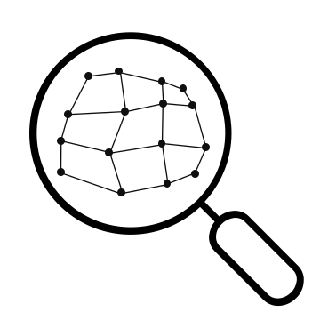
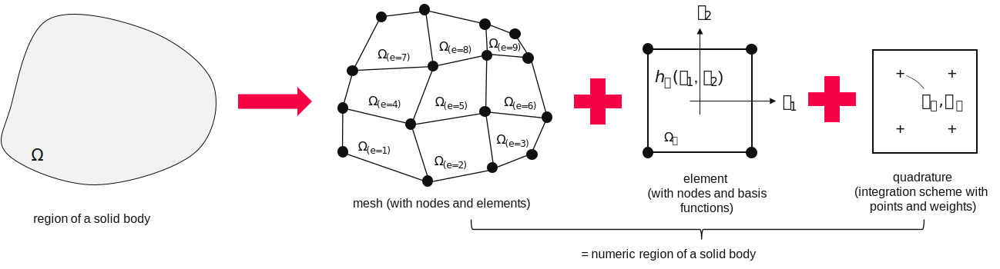
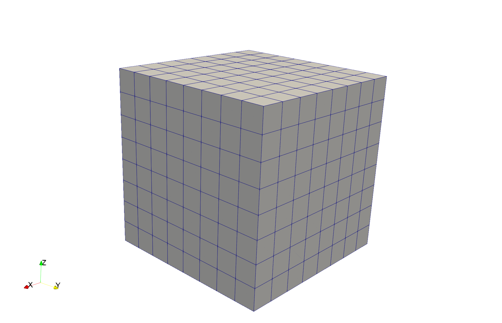
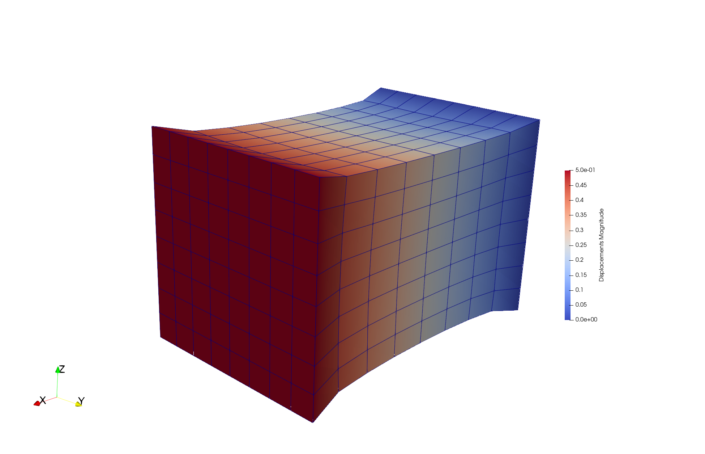

# FElupe - Finite Element Analysis

[](https://www.gnu.org/licenses/gpl-3.0)   [](https://github.com/nschloe/purple-pi?activate)



FElupe is an open-source finite element package focussing on the formulation and numerical solution of nonlinear problems in continuum mechanics of solid bodies. Its name is a combination of FE (finite element) and the german word *Lupe* (magnifying glass) as a synonym for getting a little insight how a finite element analysis code looks like under the hood. The user code for defining the integral form of equilibrium equations as well as their linearizations over a region are kept as close as possible to the analytical expressions. FElupe is both written in Python and fast in execution times thanks to NumPy (and optional Numba). No complicated installation, just pure Python. Another key feature is the easy and straightforward definition of mixed field formulations for nearly incompressible material behavior. Several useful utilities are available, i.e. an incremental approach for the application of boundary conditions and subsequent solution of the nonlinear equilibrium equations or the calculation of forces and moments on boundaries. Finally, results are ready to be exported to VTK or XDMF files using meshio.

**Question**: *Okay, why not use existing projects like Fenics or scikit-fem?*
Fenics is great but way too complicated to install on Windows. Scikit-fem is close to perfection but slow (too slow) for my problems of interest in combination with hyperelastic material formulations. In fact the utilities of FElupe could also be wrapped around the core code of scikit-fem but in the end I decided to create a code base which works the way I think it should.

## Installation
Install Python, fire up a terminal an run `pip install felupe`; import FElupe as follows in your script.

```python
import felupe as fe
```

## Getting started
Start setting up a problem in FElupe by the creation of a Region with a geometry (Mesh), a finite Element and a Quadrature rule. 



### Region
A region essentially pre-calculates basis functions and derivatives evaluated at every quadrature point of every element. An array containing products of quadrature weights multiplied by the geometrical jacobians is stored as the differential volume.

```python
mesh = fe.mesh.Cube(n=9)
element = fe.element.Hex1()
quadrature = fe.quadrature.Linear(dim=3)

region = fe.Region(mesh, element, quadrature)

dV = region.dV
V = dV.sum()
```



### Field
In a second step fields may be added to the Region. These may be either scalar or vector-valued fields. The nodal values are obtained with the attribute `values`. Interpolated field values at quadrature points are calculated with the `interpolate()` method.

```python
displacement = fe.Field(region, dim=3)

u  = displacement.values
ui = displacement.interpolate()
```

Additionally, the displacement gradient w.r.t. the undeformed coordinates is calculated for every quadrature point of every element in the region with the field method `grad()`. `interpolate` and `grad` methods are also callable from functions of the math module. The deformation gradient is obtained by a sum of the identity and the displacement gradient.

```python
dudX = displacement.grad()

# use math function for better readability
from felupe.math import grad, identity

dudX = grad(displacement)

F = identity(dudX) + dudX
```

### Constitution
The material behavior has to be provided by the first Piola-Kirchhoff stress tensor as a function of the deformation gradient. FElupe provides a constitution library which contains a definition for the Neo-Hookean material model and the associated fourth-order elasticity tensor.

$$\boldsymbol{P} = \mu J^{-2/3} \left(\boldsymbol{F} - \frac{\boldsymbol{F} : \boldsymbol{F}}{3} \boldsymbol{F}^{-T} \right) + K (J-1) J \boldsymbol{F}^{-T} $$

```python
umat = fe.constitution.NeoHooke(mu=1.0, bulk=2.0)

P = umat.f_u(F)
A = umat.A_uu(F)
```

### Boundary Conditions
Next we introduce boundary conditions on the displacement field. Boundary conditions are stored inside a dictionary of multiple boundary instances. First, we fix the left surface of the cube. Displacements on the right surface are fixed in directions y and z whereas displacements in direction x are prescribed with a value. A boundary instance hold useful attributes like `nodes` or `dof`.

```python
import numpy as np

f0 = lambda x: np.isclose(x, 0)
f1 = lambda x: np.isclose(x, 1)

boundaries = {}
boundaries["left"]  = fe.Boundary(displacement, fx=f0)
boundaries["right"] = fe.Boundary(displacement, fx=f1, skip=(1,0,0))
boundaries["move"]  = fe.Boundary(displacement, fx=f1, skip=(0,1,1), value=0.5)
```

### Partition of deegrees of freedom
The separation of active and inactive degrees of freedom is performed by a so-called partition. External values of prescribed displacement degrees of freedom are obtained by the application of the boundary values to the displacement field.

```python
dof0, dof1, _ = fe.doftools.partition(displacement, boundaries)
u0ext = fe.doftools.apply(displacement, boundaries, dof0)
```

### Integral forms of equilibrium equations
The integral (or weak) forms of equilibrium equations are defined by the `IntegralForm` class. The function of interest has to be passed as the `fun` argument whereas the virtual field as the `v` argument. Setting `grad_v=True` FElupe passes the gradient of the virtual field to the integral form. FElupe assumes a linear form if `u=None` (default) or create a bilinear form if a field is passed to the argument `u`.

$\int_V P_i^{\ J} : \frac{\partial \delta u^i}{\partial X^J} \ dV \qquad$ and $\qquad \int_V \frac{\partial \delta u^i}{\partial X^J} : \mathbb{A}_{i\ k\ }^{\ J\ L} : \frac{\partial u^k}{\partial X^L} \ dV$

```python
linearform = fe.IntegralForm(P, displacement, dV, grad_v=True)
bilinearform = fe.IntegralForm(A, displacement, dV, displacement, grad_v = True, grad_u=True)
```

An assembly of the forms lead to the (nodal) internal forces and the (sparse) stiffness matrix.

```python
r = linearform.assemble(parallel=True).toarray()[:,0]
K = bilinearform.assemble(parallel=True)
```

### Prepare (partition) and solve the linearized equation system
In order to solve the linearized equation system a partition into active and inactive degrees of freedom has to be performed. This system may then be passed to the sparse direct solver. This (linear) solution is the first result of a newton-rhapson iterative solution procedure. The resulting nodal values `du` are finally added to the displacement field. Given a set of nonlinear equilibrium equations $\boldsymbol{g}$ the unknowns $\boldsymbol{u}$ are found by linearization and an iterative solution prodecure. The incremental values of inactive degrees of freedom are given as the difference of external prescribed and current values of unknowns.

$\boldsymbol{g}_1(\boldsymbol{u}) = -\boldsymbol{r}_1(\boldsymbol{u}) + \boldsymbol{f}_1$

$\boldsymbol{g}_1(\boldsymbol{u} + d\boldsymbol{u}) \approx -\boldsymbol{r}_1 + \boldsymbol{f}_1 - \frac{\partial \boldsymbol{r}_1}{\partial \boldsymbol{u}_1} \ d\boldsymbol{u}_1 - \frac{\partial \boldsymbol{r}_1}{\partial \boldsymbol{u}_0} \ d\boldsymbol{u}_0 = \boldsymbol{0}$

$d\boldsymbol{u}_0 = \boldsymbol{u}_0^{(ext)} - \boldsymbol{u}_0$

$\boldsymbol{K}_{11} \ d\boldsymbol{u}_1 = \boldsymbol{g}_1 - \boldsymbol{K}_{1 0}$ 

$\boldsymbol{K}_{1 0} \ d\boldsymbol{u}_{0}$ 

$\boldsymbol{u} += d\boldsymbol{u}$

```python
system = fe.solve.partition(displacement, K, dof1, dof0, r)
du = fe.solve.solve(*system, u0ext).reshape(*u.shape)
# displacement += du
```

A very simple newton-rhapson code looks like this:

```python
for iteration in range(8):
    dudX = grad(displacement)
    F = identity(dudX) + dudX
    P = umat.f_u(F)
    A = umat.A_uu(F)
    
    r = fe.IntegralForm(P, displacement, dV, grad_v=True).assemble().toarray()[:,0]
    K = fe.IntegralForm(A, displacement, dV, displacement, True, True).assemble()
    
    system = fe.solve.partition(displacement, K, dof1, dof0, r)
    du = fe.solve.solve(*system, u0ext).reshape(*u.shape)
    
    norm = np.linalg.norm(du)
    print(iteration, norm)
    displacement += du

    if norm < 1e-12:
        break
```

```python
0 8.174180680860697
1 0.2940958778404002
2 0.02083230945148837
3 0.00010289925344210932
4 6.0171532522337204e-09
5 5.490863535572125e-16
```

### Export of results
Results can be exported as VTK or XDMF files using meshio.

```python
fe.utils.save(region, displacement, filename="result")
```



## Utilities
The above code snippets and explanations cover only the essential parts of FElupe. Several utilities are available - please have a look at the scripts folder or the source code itself.

## License
FElupe - finite element analysis (C) 2021 Andreas Dutzler, Graz (Austria).

This program is free software: you can redistribute it and/or modify it under the terms of the GNU General Public License as published by the Free Software Foundation, either version 3 of the License, or (at your option) any later version.

This program is distributed in the hope that it will be useful, but WITHOUT ANY WARRANTY; without even the implied warranty of MERCHANTABILITY or FITNESS FOR A PARTICULAR PURPOSE. See the GNU General Public License for more details.

You should have received a copy of the GNU General Public License along with this program. If not, see <https://www.gnu.org/licenses/>.