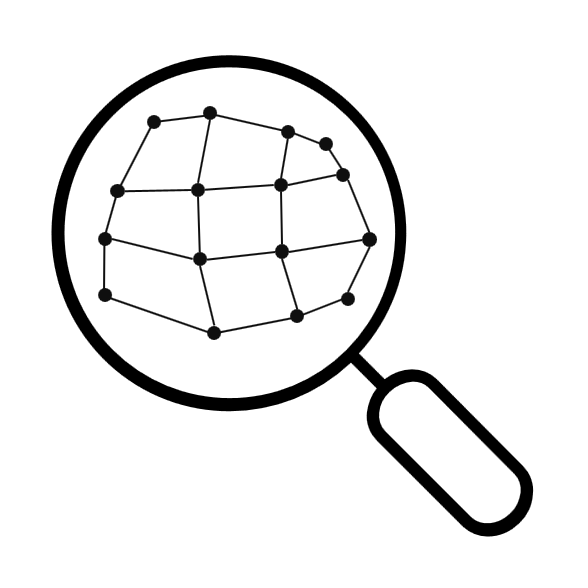

# felupe <small>alpha</small>

> Finite Element Analysis

  

- :100: Python :arrow_right: easy install and intuitive usage :ok_hand:
- :steam_locomotive: hyperelastic problems of solid mechanics :page_with_curl:

[GitHub](https://github.com/adtzlr/felupe)
[Get Started](#felupe)
