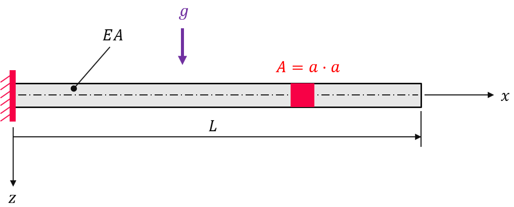

Cantilever beam under gravity
-----------------------------

.. admonition:: Assemble a body force vector due to gravity.
   :class: note

   * define the body force vector
   
   * linear-elastic analysis

The displacement due to gravity of a cantilever beam with young's modulus :math:`E=206000 N/mm^2`, poisson ratio :math:`\nu=0.3`, length :math:`L=2000 mm` and cross section area :math:`A=a \cdot a` with :math:`a=100 mm` is to be evaluated within a linear-elastic analysis.

First, let's create a meshed cube out of hexahedron cells with ``n=(181, 9, 9)`` points per axis. A numeric region created on the mesh represents the cantilever beam. A vector-valued displacement field is initiated on the region.

..  code-block:: python

    import numpy as np
    import felupe as fem

    cube = fem.Cube(a=(0, 0, 0), b=(2000, 100, 100), n=(181, 9, 9))
    region = fem.RegionHexahedron(cube)
    displacement = fem.Field(region, dim=3)
    field = fem.FieldContainer([displacement])

A fixed boundary condition is applied on the left end of the beam.

..  code-block:: python

    boundaries = {"fixed": fem.dof.Boundary(displacement, fx=0)}
    dof0, dof1 = fem.dof.partition(field, boundaries)

The material behavior is defined through a built-in isotropic linear-elastic material formulation.

.. math::

   \delta W_{int} = - \int_v \delta \boldsymbol{\varepsilon} : \mathbb{C} : \boldsymbol{\varepsilon} \ dv

..  code-block:: python

    umat = fem.LinearElastic(E=206000, nu=0.3)
    solid = fem.SolidBody(umat=umat, field=field)

The body force is defined by a (constant) gravity field on a solid body.

..  math::

    \delta W_{ext} = \int_v \delta \boldsymbol{u} \cdot \rho \boldsymbol{g} ~ dv

..  code-block:: python

    gravity = fem.SolidBodyGravity(
        field, gravity=[0, 0, 9810], density=7850 * 1e-12
    )

Inside a Newton-Rhapson procedure, the weak form of linear elasticity is assembled into the stiffness matrix and the applied gravity field is assembled into the body force vector. The maximum displacement of the solution is identical to the one obtained in `[1] <https://www.doi.org/10.5545/sv-jme.2017.5081>`_.

..  code-block:: python

    res = fem.newtonrhapson(items=[solid, gravity], dof0=dof0, dof1=dof1)
    fem.save(region, field, filename="bodyforce.vtk")

.. image:: images/beam_bodyforce.png

References
~~~~~~~~~~

`[1] <https://www.doi.org/10.5545/sv-jme.2017.5081>`_ Glenk C. et al., *Consideration of Body Forces within Finite Element Analysis,* Strojniški vestnik - Journal of Mechanical Engineering, Faculty of Mechanical Engineering, 2018, |DOI|

.. |DOI| image:: https://zenodo.org/badge/DOI/10.5545/sv-jme.2017.5081.svg
   :target: https://www.doi.org/10.5545/sv-jme.2017.5081