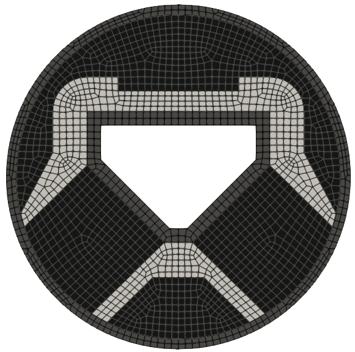
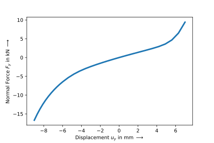
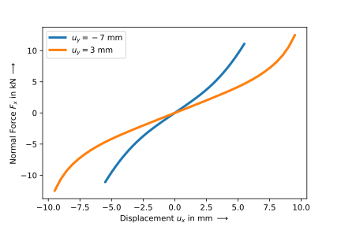
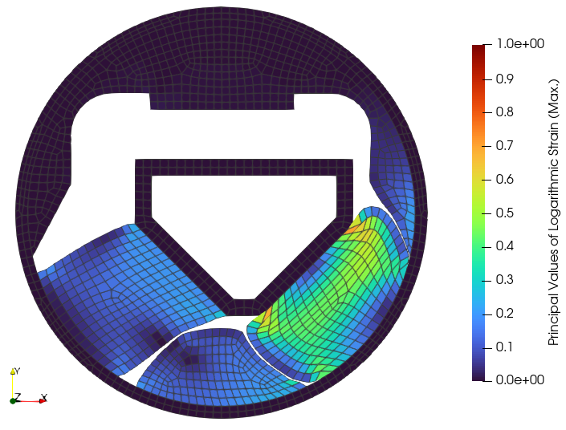

Engine Mount
------------

.. admonition:: A rubber-metal component used as an engine-mount.
   :class: note

   * read and combine mesh files
   
   * define a nearly-incompressible isotropic hyperelastic solid body
   
   * create consecutive steps and add them to a job
   
   * export and plot characteristic curves

An engine-mount is loaded by a combined vertical and horizontal displacement. What is being looked for are the characteristic force-displacement curves in vertical and horizontal directions as well as the logarithmic strain distribution inside the rubber. The air inside the structure is meshed as a hyperelastic solid with no volumetric part of the strain energy function for a simplified treatment of the rubber contact. A reduced bulk modulus is used for the rubber in order to provide realistic results of the plane-strain analysis model compared to the three-dimensional real-world component. The metal parts are simplified as rigid bodies. Three mesh files are provided for this example: a `mesh for the metal parts <../_static/engine-mount_metal.vtk>`_, a `mesh for the rubber blocks <../_static/engine-mount_rubber.vtk>`_ as well as a `mesh for the air <../_static/engine-mount_air.vtk>`_ inside the engine mount.

..  code-block:: python

    import felupe as fem
    import numpy as np

    metal = fem.mesh.read("engine-mount_metal.vtk", dim=2)[0]
    rubber = fem.mesh.read("engine-mount_rubber.vtk", dim=2)[0]
    air = fem.mesh.read("engine-mount_air.vtk", dim=2)[0]

    # sub-meshes with shared points-array and a global mesh
    meshes = fem.MeshContainer([metal, rubber, air], merge=True)
    mesh = fem.mesh.concatenate(meshes).sweep()
    
    # a mesh used for the results (without air)
    xdmf = mesh.copy()
    xdmf.update(cells=mesh.cells[:-air.ncells])
    xdmf = xdmf.as_meshio()

A global region as well as sub-regions for all materials are generated. The same applies to the fields.

..  code-block:: python
    
    region = fem.RegionQuad(mesh)
    regions = [fem.RegionQuad(m) for m in meshes]

    field = fem.FieldsMixed(region, n=1, planestrain=True)
    fields = [fem.FieldsMixed(r, n=1, planestrain=True) for r in regions]

The boundary conditions are created on the global displacement field. First, a mask for all points related to the metal parts is created. Then, this mask is splitted into the inner and the outer metal part.

..  code-block:: python

    x, y = mesh.points.T
    radius = np.sqrt(x ** 2 + y ** 2)
    
    only_cells_metal = np.isin(np.arange(mesh.npoints), np.unique(meshes[0].cells))
    inner = np.logical_and(only_cells_metal, radius <= 45)
    outer = np.logical_and(only_cells_metal, radius > 45)
    
    boundaries = dict(
    fixed=fem.Boundary(field[0], mask=outer),
    u_x=fem.Boundary(field[0], mask=inner, skip=(0, 1, 1)),
    u_y=fem.Boundary(field[0], mask=inner, skip=(1, 0, 1)),
    u_z=fem.Boundary(field[0], mask=inner, skip=(1, 1, 0)),
)

The material behaviour of the rubber is defined through a built-in hyperelastic isotropic Neo-Hookean material formulation. A solid body, suitable for nearly-incompressible material formulations, applies the material formulation on the displacement field. The air is also simulated by a Neo-Hookean material formulation but with no volumetric contribution and hence, no special mixed-field treatment is necessary here. A crucial parameter is the shear modulus which is used for the simulation of the air. The air is meshed and simulated to capture the contacts of the rubber blocks inside the engine mount during the deformation. Hence, its overall stiffness contribution must be as low as possible. Here, one fiftieth of the shear modulus of the rubber is used. The bulk modulus of the rubber is lowered to provide a more realistic deformation for the three-dimensional component simulated by a plane-strain analysis.

..  code-block:: python

    shear_modulus = 1
    rubber = fem.SolidBodyNearlyIncompressible(
        umat=fem.NeoHooke(mu=shear_modulus), field=fields[1], bulk=100
    )
    air = fem.SolidBody(umat=fem.NeoHooke(mu=shear_modulus / 50), field=fields[2])

After defining the consecutive load steps, the simulation model is ready to be solved. As we are not interested in the strains of the simulated air, a trimmed mesh is specified during the evaluation of the characteristic-curve job.

..  code-block:: python
    
    vertical = fem.Step(
        items=[rubber, air],
        ramp={boundaries["u_y"]: fem.math.linsteps([0, -9, -6], num=10)},
        boundaries=boundaries
    )
    horizontal_1 = fem.Step(
        items=[rubber, air],
        ramp={boundaries["u_x"]: 5.5 * fem.math.linsteps([0, 1, 0,-1, 0], num=20)},
        boundaries=boundaries
    )
    vertical_2 = fem.Step(
        items=[rubber, air],
        ramp={boundaries["u_y"]: fem.math.linsteps([-6, 0, 7, 0], num=10)},
        boundaries=boundaries
    )
    horizontal_2 = fem.Step(
        items=[rubber, air],
        ramp={boundaries["u_x"]: 9.5 * fem.math.linsteps([0, 1, 0,-1, 0], num=20)},
        boundaries=boundaries
    )

    job = fem.CharacteristicCurve(
        steps=[vertical, horizontal_1, vertical_2, horizontal_2],
        boundary=boundaries["u_y"]
    )
    job.evaluate(
        x0=field, 
        filename="result.xdmf", 
        tol=1e-2, 
        mesh=xdmf,
    )

..  raw:: html

    <video controls>
      <source src="../_static/engine-mount_animation.mp4" type="video/mp4">
    Your browser does not support the video tag.
    </video>

The vertical force-displacement curve is obtained from the characteristic-curve job.

..  code-block:: python

    fig, ax = job.plot(
        xlabel="Displacement $u_y$ in mm $\longrightarrow$",
        ylabel="Normal Force $F_y$ in kN $\longrightarrow$",
        xaxis=1, 
        yaxis=1, 
        yscale=1 / 1000 * 100, # multiplied by the thickness
        ls="-",
        lw=3,
        items=np.append(np.arange(10, 20), np.arange(100, 130))
    )
    fig.savefig("engine-mount_Fy-uy.svg")

The lateral force-displacement curves are plotted for the two different levels of vertical displacement.

..  code-block:: python

    fig, ax = job.plot(
        xlabel="Displacement $u_x$ in mm $\longrightarrow$",
        ylabel="Normal Force $F_x$ in kN $\longrightarrow$",
        xaxis=0, 
        yaxis=0, 
        yscale=1 / 1000 * 100, # multiplied by the thickness
        lw=3,
        color="C0",
        items=range(20, 100),
        label=r"$u_y=-7$ mm"
    )

    fig, ax = job.plot(
        xlabel="Displacement $u_x$ in mm $\longrightarrow$",
        ylabel="Normal Force $F_x$ in kN $\longrightarrow$",
        xaxis=0, 
        yaxis=0, 
        yscale=1 / 1000 * 100, # multiplied by the thickness
        lw=3,
        color="C1",
        items=range(130, 210),
        fig=fig,
        ax=ax,
        label=r"$u_y=3$ mm"
    )
    ax.legend()

