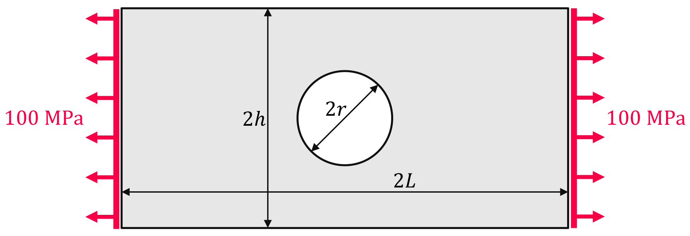

Plate with a Hole
-----------------

.. admonition:: Plane stress structural linear analysis.
   :class: note

   * create and mesh a plate with a hole
   
   * define a solid body with a linear-elastic plane stress material
   
   * create an external pressure load
   
   * export and plot stress results

A plate with length :math:`2L`, height :math:`2h` and a hole with radius :math:`r` is subjected to a uniaxial tension :math:`p=-100` MPa. What is being looked for is the von Mises stress distribution and the concentration of normal stress :math:`\sigma_{11}` over the hole.

Let's create a meshed plate with a hole out of quad cells with the help of ``pygmsh`` (install with ``pip install pygmsh``). Only a quarter model of the plate is considered. A boolean difference between a rectangle and a disk results in a plate with a hole. This plate is meshed with triangles. A so-called *re-combination* of the surface mesh gives a mesh with quad cells.

..  code-block:: python

    import felupe as fem
    import pygmsh

    h = 1.0
    L = 2.0
    r = 0.3

    with pygmsh.occ.Geometry() as geom:
        
        geom.characteristic_length_min = 0.02
        geom.characteristic_length_max = 0.02

        rectangle = geom.add_rectangle([0, 0, 0], L, h)
        disk = geom.add_disk([0, 0, 0], r)
        
        plate = geom.boolean_difference(rectangle, disk)
        
        geom.set_recombined_surfaces(plate)
        mesh = geom.generate_mesh()

The points and cells of the above mesh are used to initiate a FElupe mesh.

..  code-block:: python

    mesh = fem.Mesh(
        points=mesh.points[:, :2], 
        cells=mesh.cells[1].data, 
        cell_type=mesh.cells[1].type
    )

.. image:: images/platewithhole_mesh.png
   :width: 400px

A numeric quad-region created on the mesh in combination with a vector-valued displacement field represents the plate. The Boundary conditions for the symmetry planes are generated on the displacement field.

..  code-block:: python

    region = fem.RegionQuad(mesh)
    displacement = fem.Field(region, dim=2)
    field = fem.FieldContainer([displacement])

    boundaries = fem.dof.symmetry(displacement)

The material behavior is defined through a built-in isotropic linear-elastic material formulation for plane stress problems. A solid body applies the linear-elastic material formulation on the displacement field.

..  code-block:: python

    umat = fem.LinearElasticPlaneStress(E=210000, nu=0.3)
    solid = fem.SolidBody(umat, field)

The external uniaxial tension is applied by a pressure load on the right end at :math:`x=L`. Therefore, a boundary region in combination with a field has to be created at :math:`x=L`.

..  code-block:: python

    region_boundary = fem.RegionQuadBoundary(mesh, mask=mesh.points[:, 0] == L)
    field_boundary = fem.FieldContainer([fem.Field(region_boundary, dim=2)])
    
    load = fem.SolidBodyPressure(field_boundary, pressure=-100)

The equivalent stress von Mises, projected to mesh points, will be added to the result file. For the two-dimensional case it is calculated by:

.. math::

   \sigma_{vM} = \sqrt{\sigma_{11}^2 + \sigma_{22}^2 + 3 \ \sigma_{12}^2 + \sigma_{11} \ \sigma_{22}}

..  code-block:: python

    import numpy as np
    
    def von_mises(field, **kwargs):
        "Von Mises Stress projected to mesh points."
        
        stress = solid.evaluate.gradient(field)[0]
        
        vonmises = np.sqrt(
            stress[0, 0] ** 2 + stress[1, 1] ** 2 + 3 * stress[0, 1] ** 2 +
            stress[0, 0] * stress[1, 1]
        )
    
        return fem.project(vonmises, region)

The simulation model is now ready to be solved. The results are saved within a XDMF-file, where additional point-data is passed to the ``point_data`` argument. 

..  code-block:: python
    
    step = fem.Step(items=[solid, load], boundaries=boundaries)
    job = fem.Job(steps=[step])
    job.evaluate(filename="result.xdmf", point_data={"von Mises Stress": von_mises})

.. image:: images/platewithhole_stress_continuous_alpha.png

The normal stress distribution over the hole at :math:`x=0` is plotted with matplotlib.

..  code-block:: python

    import matplotlib.pyplot as plt

    left = mesh.points[:, 0] == 0

    plt.plot(
        fem.tools.project(solid.results.stress[0], region)[:, 0][left],
        mesh.points[:, 1][left] / h,
        "o-"
    )

    plt.xlabel(r"$\sigma_{11}(x=0, y)$ in MPa $\longrightarrow$")
    plt.ylabel(r"$y/h$ $\longrightarrow$")

.. image:: images/platewithhole_stressplot.svg
