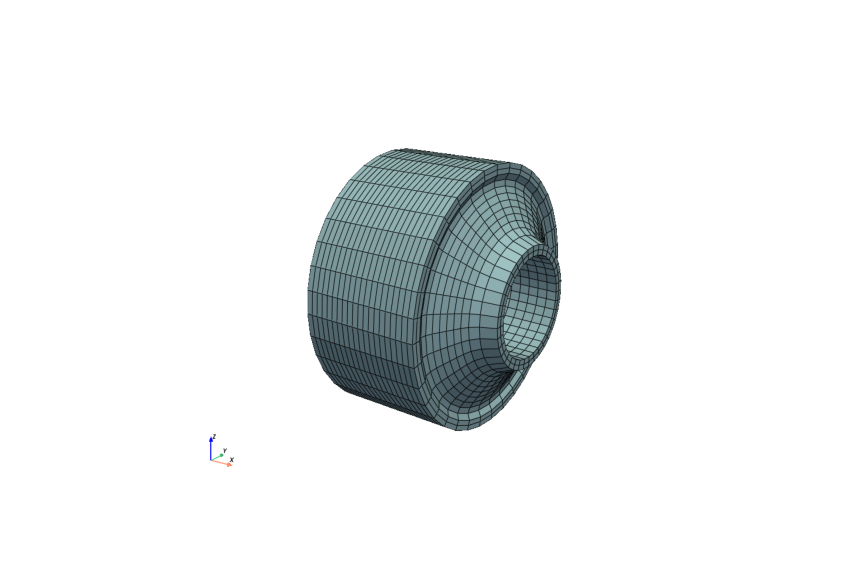
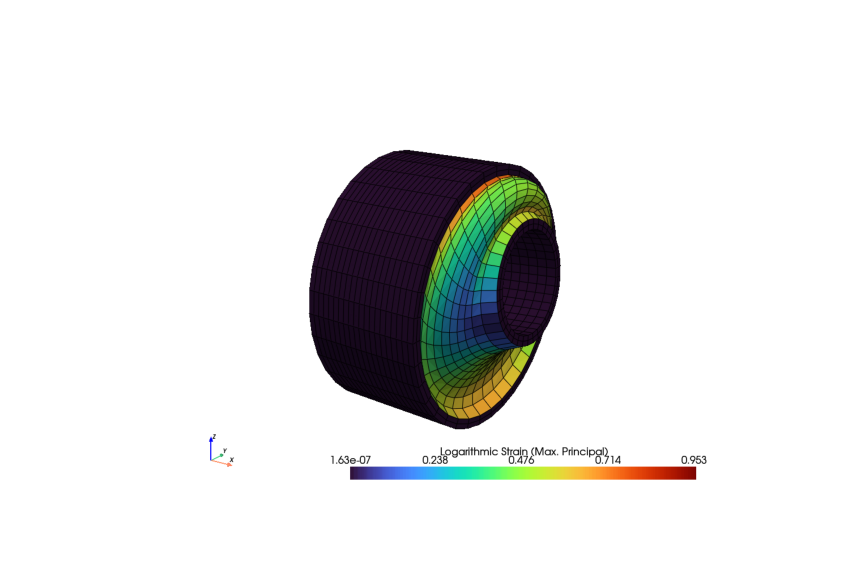
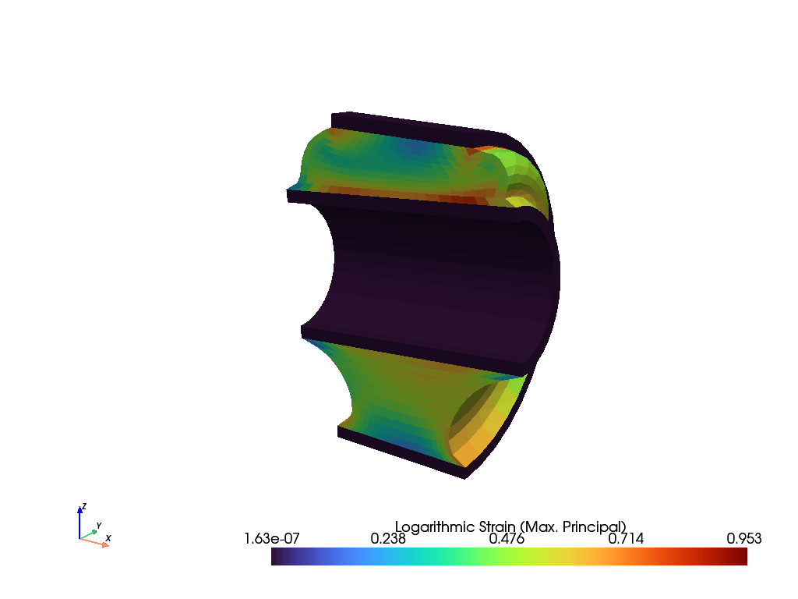
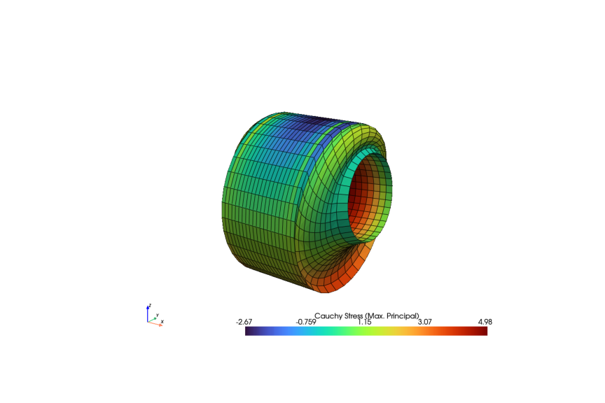
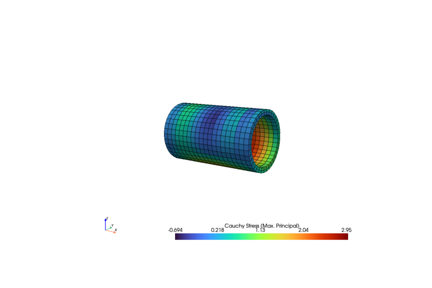
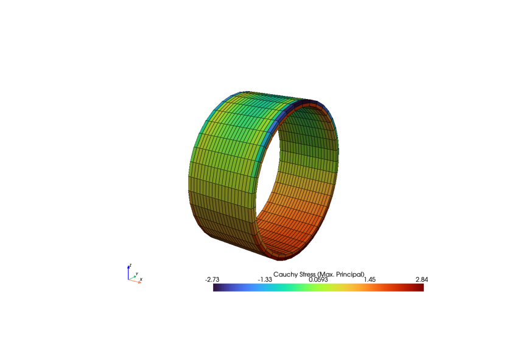

Rubber bushing with torsional loading
-------------------------------------

.. admonition:: A rubber-metal bushing with combined multiaxial loading.
   :class: note

   * create and stack meshes

   * define a boundary condition with torsional loading
   
   * work with multiple solid bodies
   
   * create a step and add it to a job
   
   * plot strains and stresses

A rubber-metal bushing is subjected to combined multiaxial radial-torsional-cardanic loading. First the meshes for the rubber and the metal sheet rings are created.

..  code-block:: python

    import numpy as np
    from pypardiso import spsolve
    import felupe as fem

    # inner and outer line meshes for the rubber
    bottom = fem.mesh.Line(a=-50, b=50, n=21)
    top = fem.mesh.Line(a=-30, b=30, n=21)

    # embed line meshes in 2d-space
    bottom.update(np.pad(bottom.points, ((0, 0), (0, 1)), constant_values=30))
    top.update(np.pad(top.points, ((0, 0), (0, 1)), constant_values=60))

    # fill face with quads between the two line meshes, add realistic runouts
    section = fem.mesh.fill_between(bottom, top, n=11)
    section = section.add_runouts(axis=1, centerpoint=[0, 45], values=[0.2], normalize=True)

    # revolve the face for the rubber volume
    rubber = section.revolve(n=37, phi=360)

    # create meshes for the metal sheet rings
    metals = [
        fem.Rectangle(a=(-50, 25), b=(50, 30), n=(21, 3)).revolve(n=37, phi=360),
        fem.Rectangle(a=(-30, 60), b=(30, 65), n=(21, 3)).revolve(n=37, phi=360),
    ]

    # stack the meshes
    meshes = fem.MeshContainer([rubber, *metals], merge=True)
    mesh = fem.mesh.stack(meshes.meshes)
    x, y, z = mesh.points.T

A global region as well as sub-regions for all materials are generated. The same applies to the fields, the material formulations as well as the solid bodies.

..  code-block:: python
    
    region = fem.RegionHexahedron(mesh)
    regions = [fem.RegionHexahedron(m) for m in meshes]
    field = fem.FieldContainer([fem.Field(region, dim=3)])
    fields = [fem.FieldContainer([fem.Field(r, dim=3)]) for r in regions]

    # material formulations and solid bodies for the rubber and the metal sheets
    umats = [fem.NeoHooke(mu=1), fem.LinearElasticLargeStrain(E=2.1e5, nu=0.3)]
    solids = [
        fem.SolidBodyNearlyIncompressible(umats[0], fields[0], bulk=5000),
        fem.SolidBody(umats[1], fields[1]),
        fem.SolidBody(umats[1], fields[2]),
    ]

The boundary conditions are created on the global displacement field. Masks are created for both the innermost and the outermost metal sheet faces.

..  code-block:: python

    # create boundary conditions for the innermost and outermost radial points
    boundaries = {
        "inner": fem.dof.Boundary(field[0], mask=np.isclose(np.sqrt(y**2 + z**2), 25)),
        "outer": fem.dof.Boundary(field[0], mask=np.isclose(np.sqrt(y**2 + z**2), 65)),
    }

    # prescribed values for the innermost radial mesh points
    table = fem.math.linsteps([0, 1], num=3)
    move = []

    for progress in table:
        inner = mesh.points[boundaries["inner"].points]
        inner_rotated = fem.mesh.rotate(
            points=inner,
            cells=None,
            cell_type=None,
            angle_deg=30 * progress,
            axis=0,
            center=[0, 0, 0],
        )[0]
        inner_rotated = fem.mesh.rotate(
            points=inner_rotated,
            cells=None,
            cell_type=None,
            angle_deg=-5 * progress,
            axis=1,
            center=[0, 0, 0],
        )[0]
        inner_radial = 8 * np.array([0, 0, 1]) * progress
        move.append((inner_radial + inner_rotated - inner).ravel())

After defining the load step, the simulation model is ready to be solved. The log. strain and the Cauchy stresses are plotted for the solid bodies.

..  code-block:: python
    
    # create a step and evaluate the job
    step = fem.Step(items=solids, ramp={boundaries["inner"]: move}, boundaries=boundaries)
    job = fem.Job(steps=[step])
    job.evaluate(x0=field, parallel=True, solver=spsolve)

    # evaluate and plot the log. strain and the Cauchy stresses for all solid bodies
    plotter = field.plot(
        "Principal Values of Logarithmic Strain",
        show_undeformed=False,
        show_edges=False,
    )
    plotter.mesh.clip("y", invert=False, value=0.0, inplace=True)
    plotter.show()

    ax = field.imshow("Principal Values of Logarithmic Strain", show_undeformed=False)
    axes = [
        solid.imshow("Principal Values of Cauchy Stress", show_undeformed=False)
        for solid in solids
    ]

The maximum principal values of the logarithmic strain are plotted on the total simulation model as well as on a clipped view.

Cauchy stresses are plotted individually for each solid body.

