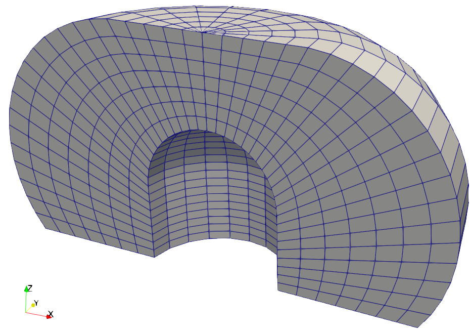
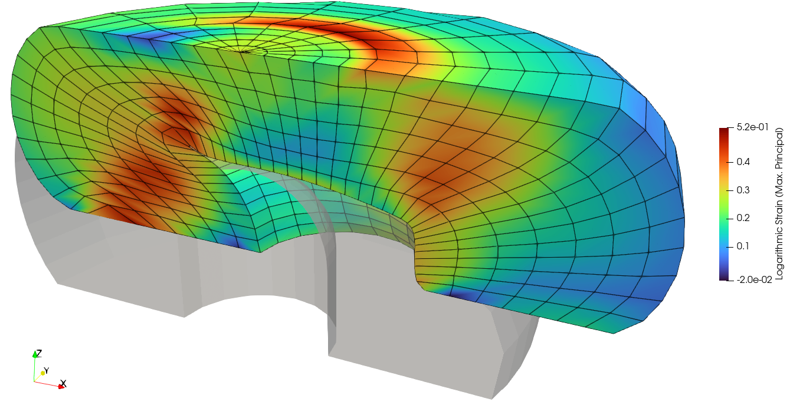
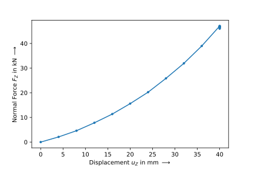

Rubber Spring
-------------

.. admonition:: A rubber-metal spring with a simplified frictionless contact.
   :class: note

   * read a mesh file
   
   * define a nearly-incompressible isotropic hyperelastic solid body
   
   * setup a simplified frictionless elastic-to-rigid contact interaction
   
   * export and plot the log. strain

A meshed three-dimensional geometry of a rubber-metal spring is loaded by an external axial and lateral displacement. A simplified elastic-to-rigid contact definition simulates the end stop caused by a steel plate.

..  code-block:: python

    import felupe as fem
    import numpy as np

    mesh = fem.mesh.read("mesh.vtk")[0]
    X, Y, Z = mesh.points.T

A numeric hexahedron-region created on the mesh in combination with a vector-valued displacement field represents the rubber volume. The Boundary conditions for the :math:`y`-symmetry plane as well as the fixed faces on the bottom and the top of the solid are generated on the displacement field.

..  code-block:: python

    region = fem.RegionHexahedron(mesh)
    field = fem.FieldsMixed(region, n=1)
    
    boundaries = fem.dof.symmetry(field[0], axes=(0, 1, 0))
    boundaries["fixed"] = fem.Boundary(field[0], fz=Z.max())
    boundaries["move-x"] = fem.Boundary(field[0], fz=Z.min(), skip=(0, 1, 1))
    boundaries["move-y"] = fem.Boundary(field[0], fz=Z.min(), skip=(1, 0, 1))
    boundaries["move-z"] = fem.Boundary(field[0], fz=Z.min(), skip=(1, 1, 0))

The material behavior is defined through a built-in hyperelastic isotropic Neo-Hookean material formulation. A solid body, suitable for nearly-incompressible material formulations, applies the material formulation on the displacement field.

..  code-block:: python

    umat = fem.NeoHooke(mu=1)
    solid = fem.SolidBodyNearlyIncompressible(umat, field, bulk=5000)

The simplified elastic-to-rigid contact is defined by a multi-point constraint-like formulation which is only active in compression. First, the points on the surface of the solid body are determined. Then, the center (control) point is defined by one of the mesh points on the end faces in direction :math:`z`.

..  code-block:: python

    surface = np.unique(fem.RegionHexahedronBoundary(mesh).mesh_faces().cells)
    mask = np.isin(np.arange(mesh.npoints), surface)
    points = np.where(mask)[0]
    bottom = fem.MultiPointContact(
        field, 
        points=points, 
        centerpoint=np.where(Z==Z.min())[0][0], 
        skip=(1, 1, 0),
    )
    top = fem.MultiPointContact(
        field, 
        points=points, 
        centerpoint=np.where(Z==Z.max())[0][0], 
        skip=(1, 1, 0),
    )

The max. principal value of the logarithmic strain, projected to mesh points, will be added to the result file.

..  code-block:: python
    
    def log_strain(substep):
        "Project the max. principal log. strain from quadrature- to mesh-points."
        
        F = substep.x.extract()[0]
        C = fem.math.dot(fem.math.transpose(F), F)
        strain = np.log(fem.math.eigvalsh(C)[-1]) / 2
        
        return fem.project(strain, region)

The simulation model is now ready to be solved. The results are saved within a XDMF-file, where additional point-data is passed to the ``point_data`` argument. 

..  code-block:: python
    
    table1 = fem.math.linsteps([0, 1], num=10)
    table2 = fem.math.linsteps([0, 1], num=10)

    axial = fem.Step(
        items=[solid, top, bottom],  #, top, bottom
        ramp={boundaries["move-z"]: 40 * table1}, 
        boundaries=boundaries
    )
    lateral = fem.Step(
        items=[solid, top, bottom], 
        ramp={boundaries["move-x"]: 40 * table2}, 
        boundaries=boundaries
    )
    
    job = fem.CharacteristicCurve(steps=[axial, lateral], boundary=boundaries["move-z"])
    job.evaluate(
        filename="result.xdmf", 
        kwargs={"parallel": True}, 
        point_data = {"Logarithmic Strain (Max. Principal)": log_strain}
    )

The compressive axial force-displacement curve is obtained from the characteristic-curve
job. The force is multiplied by two due to the fact that only one half of the geometry
is simulated.

..  code-block:: python

    fig, ax = job.plot(
        xlabel="Displacement $u_Z$ in mm $\longrightarrow$",
        ylabel="Normal Force $F_Z$ in kN $\longrightarrow$",
        xaxis=2,
        yaxis=2,
        yscale=2 / 1000,
    )

