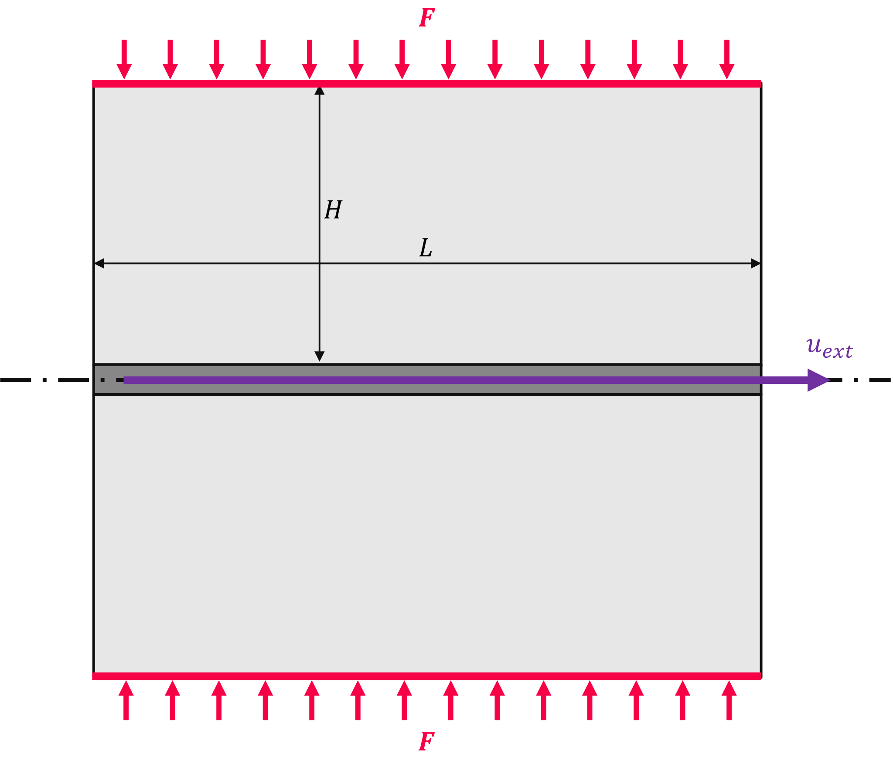
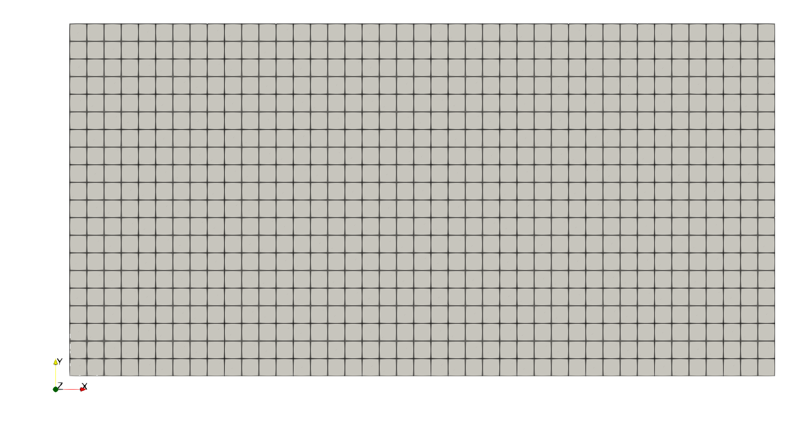
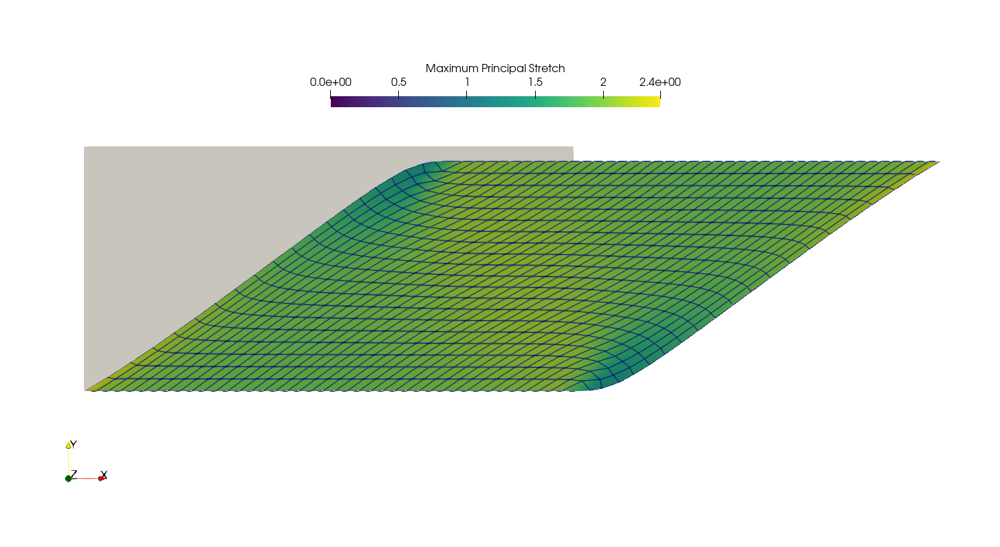
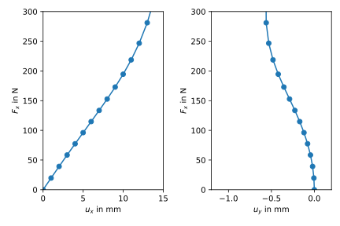

Non-homogeneous shear loadcase
------------------------------

.. admonition:: Plane strain hyperelastic non-homogenous shear loadcase
   :class: note

   * define a non-homogeneous shear loadcase
   
   * use a mixed hyperelastic formulation in plane strain
   
   * assign a micro-sphere material formulation

   * define a step and a job along with a callback-function
   
   * export and visualize principal stretches
   
   * plot force - displacement curves

Two rubber blocks of height :math:`H` and length :math:`L`, both glued to a 
rigid plate on their top and bottom faces, are subjected to a displacement 
controlled non-homogeneous shear deformation by :math:`u_{ext}` in combination 
with a compressive normal force :math:`F`.

Let's create the mesh. An additional center-point is created for a multi-point
constraint (MPC). By default, FElupe stores points not connected to any cells in
:attr:`Mesh.points_without_cells` and adds them to the list of inactive
degrees of freedom. Hence, we have to drop our MPC-centerpoint from that list.

..  code-block:: python

    import numpy as np
    import felupe as fe

    H = 10
    L = 20
    T = 10
    
    n = 21
    a = min(L / n, H / n)
    
    mesh = fe.Rectangle((0, 0), (L, H), n=(round(L / a), round(H / a)))
    mesh.points = np.vstack((mesh.points, [0, 2 * H]))
    mesh.update(mesh.cells)
    mesh.points_without_cells = np.array([], dtype=bool)

A numeric quad-region created on the mesh in combination with a vector-valued 
displacement field for plane-strain as well as scalar-valued fields for the hydrostatic pressure and the volume ratio represents the rubber numerically. A shear loadcase is applied on the displacement field. This involves setting up a y-symmetry plane as well as the absolute value of the prescribed shear movement in direction :math:`x` at the MPC-centerpoint.

..  code-block:: python

    region = fe.RegionQuad(mesh)
    fields = fe.FieldsMixed(region, n=3, planestrain=True)
    
    f0 = lambda y: np.isclose(y, 0)
    f2 = lambda y: np.isclose(y, 2* H)
    
    boundaries = {
        "fixed": fe.Boundary(fields[0], fy=f0),
        "control": fe.Boundary(fields[0], fy=f2, skip=(0, 1)),
    }
    
    dof0, dof1 = fe.dof.partition(fields, boundaries)

The micro-sphere material formulation is used for the rubber. It is defined
as a hyperelastic material in matADi. The material formulation is finally applied on the plane-strain field, resulting in a hyperelastic solid body.

.. admonition:: **MatADi** - Material Definition with Automatic Differentiation
   :class: note
   
   MatADi is a powerful and lightweight Python package for the definition of hyperelastic material model formulations. Do not use the ``MaterialHyperelasticPlaneStrain()`` and ``ThreeFieldVariationPlaneStrain()`` classes of matADi in combination with a plane-strain field of FElupe. These classes are designed to be used on default two dimensional fields (i.e. use it only with ``fe.FieldsMixed(region, n=3, planestrain=False``). Get matADi on PyPI: 
   
   ..  code-block::
       
       pip install matadi

..  code-block:: python

    import matadi as mat

    umat = mat.MaterialHyperelastic(
        mat.models.miehe_goektepe_lulei, 
        mu=0.1475, 
        N=3.273, 
        p=9.31, 
        U=9.94, 
        q=0.567, 
        bulk=5000.0,
    )
    
    rubber = fe.SolidBody(umat=mat.ThreeFieldVariation(umat), field=fields)

At the centerpoint of a multi-point constraint (MPC) the external shear
movement is prescribed. It also ensures a force-free top plate in direction 
:math:`y`.

..  code-block:: python

    mpc = fe.MultiPointConstraint(
        field=fields,
        points=np.arange(mesh.npoints)[mesh.points[:, 1] == H],
        centerpoint=mesh.npoints - 1,
    )

The shear movement is applied in substeps, which are each solved with an
iterative newton-rhapson procedure. Inside an iteration, the force residual
vector and the tangent stiffness matrix are assembled. The fields are updated
with the solution of unknowns. The equilibrium is checked as ratio between the 
norm of residual forces of the active vs. the norm of the residual forces of 
the inactive degrees of freedom. If convergence is obtained, the iteration loop
ends. Both :math:`y`-displacement and the reaction force in direction :math:`x`
of the top plate are saved. This is realized by a callback-function which is
called after each successful substep. A step combines all active items along
with constant and ramped boundary conditions. Finally, the step is added to a
job. A job returns a generator object with the results of all substeps.

..  code-block:: python

    UX = fe.math.linsteps([0, 15], 15)
    UY = []
    FX = []

    def callback(stepnumber, substepnumber, subcase):
        """Callback-function for the evaluation of the force-displacement
        characteristic curves."""
        
        # get current x-movement
        move = boundaries["control"].value
        
        UY.append(subcase.x[0].values[mpc.centerpoint, 1])
        FX.append(subcase.fun[2 * mpc.centerpoint] * T)

        print(f"Reaction Force FX(UX) = {FX[-1]:1.1f}N({move}mm)")
        return

..  code-block:: python
    
    step = fe.Step(
        items=[rubber, mpc], 
        ramp={boundaries["control"]: UX}, 
        boundaries=boundaries
    )
    job = fe.Job(steps=[step], callback=callback)
    res = job.evaluate()

For the maximum deformed model a VTK-file containing principal stretches
projected to mesh points is exported.

..  code-block:: python

    from felupe.math import transpose, dot, eigh
    
    F = fields[0].extract()
    C = dot(transpose(F), F)
    
    stretches = fe.project(np.sqrt(eigh(C)[0]), region)
    
    fe.save(region, fields, point_data={
        "Maximum-principal-stretch": np.max(stretches, axis=1),
        "Minimum-principal-stretch": np.min(stretches, axis=1),
    })

The shear force :math:`F_x` vs. the displacements :math:`u_x` and
:math:`u_y`, all located at the top plate, are plotted.

..  code-block:: python

    import matplotlib.pyplot as plt
    
    fig, ax = plt.subplots(1, 2)
    
    ax[0].plot(UX, FX, 'o-')
    ax[0].set_xlim(0, 15)
    ax[0].set_ylim(0, 300)
    ax[0].set_xlabel(r"$u_x$ in mm")
    ax[0].set_ylabel(r"$F_x$ in N")
    
    ax[1].plot(UY, FX, 'o-')
    ax[1].set_xlim(-1.2, 0.2)
    ax[1].set_ylim(0, 300)
    ax[1].set_xlabel(r"$u_y$ in mm")
    ax[1].set_ylabel(r"$F_x$ in N")
    
    plt.tight_layout()
    
    plt.savefig("shear_plot.svg")

