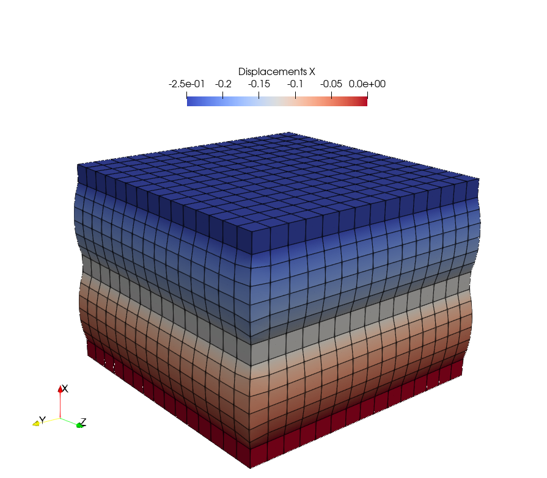
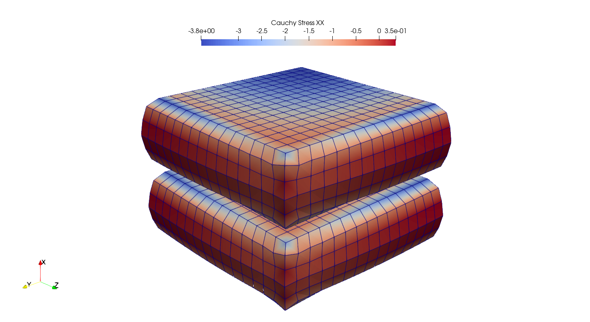

Composite Regions with Solid Bodies
-----------------------------------

This section demonstrates how to set up a problem with two regions, each associated to a seperated solid body. First, a (total) region is created.

..  code-block:: python

    import felupe as fe
    import numpy as np

    n = 16
    mesh = fe.Cube(n=n)
    region = fe.RegionHexahedron(mesh)

In a second step, sub-sets for points and cells are created from which two sub-regions and sub-fields are initiated.
    
..  code-block:: python

    points = np.arange(mesh.npoints)[np.logical_or.reduce((
        mesh.points[:,0] == 0,
        mesh.points[:,0] == 0 + 1/(n - 1),
        mesh.points[:,0] == 0.5 - 1/(n - 1) / 2,
        mesh.points[:,0] == 0.5 + 1/(n - 1) / 2,
        mesh.points[:,0] == 1 - 1/(n - 1),
        mesh.points[:,0] == 1,
    ))]
    cells = np.isin(mesh.cells, points).sum(1) == mesh.cells.shape[1]

    mesh_rubber = mesh.copy()
    mesh_rubber.update(mesh_rubber.cells[~cells])

    mesh_steel = mesh.copy()
    mesh_steel.update(mesh_steel.cells[cells])
    
    region_rubber = fe.RegionHexahedron(mesh_rubber)
    field_rubber = fe.FieldsMixed(region_rubber, n=3)

    region_steel = fe.RegionHexahedron(mesh_steel)
    field_steel = fe.FieldsMixed(region_steel, n=1)

This is followed by the creation of a global (mixed) field. Note that is approach is only valid for a simulation model with one body formulated on mixed fields.

..  code-block:: python
    
    field = fe.FieldContainer([fe.Field(region, dim=3), *field_rubber[1:]])
    
The displacement boundaries are created on the total field.

..  code-block:: python

    boundaries, loadcase = fe.dof.uniaxial(field, move=-0.1)

The rubber is associated to a Neo-Hookean material formulation whereas the steel is modeled by a linear elastic material formulation. For each material a solid body is created.

..  code-block:: python

    neohooke = fe.ThreeFieldVariation(fe.NeoHooke(mu=1.0, bulk=5000.0))
    linearelastic = fe.LinearElastic(E=210000.0, nu=0.3)
    
    rubber = fe.SolidBody(neohooke, field_rubber)
    steel = fe.SolidBody(linearelastic, field_steel)

Inside the Newton-Rhapson iterations both the internal force vector and the tangent stiffness matrix are assembled and summed up from contributions of both solid bodies. All field values are linked, that means they share their values array.

..  code-block:: python

    res = fe.newtonrhapson(field, items=[rubber, steel], **loadcase)

..  code-block:: shell

    Newton-Rhapson solver
    =====================
    
    | # |  norm(dx) |
    |---|-----------|
    | 1 | 9.075e+01 |
    | 2 | 1.370e+01 |
    | 3 | 6.998e-01 |
    | 4 | 1.105e-02 |
    | 5 | 1.658e-06 |
    | 6 | 5.446e-13 |
    
    Solution converged in 6 iterations within 63.52 seconds.

Results may be exported either for the total region or with stresses for sub-regions only.

..  code-block:: python

    s = rubber.evaluate.cauchy_stress()
    cauchy_stress = fe.project(fe.math.tovoigt(s), region_rubber)
    
    fe.save(region, res.x, filename="result.vtk")

    fe.save(region_rubber, field_rubber,
        filename="result_rubber.vtk", 
        point_data={"CauchyStress": cauchy_stress}
    )

