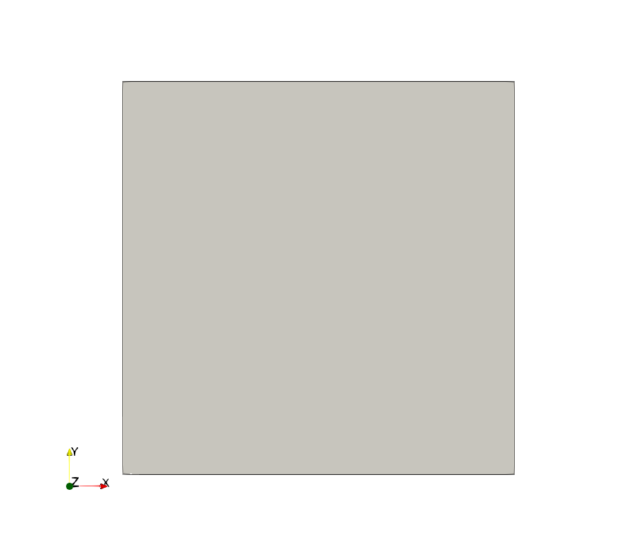
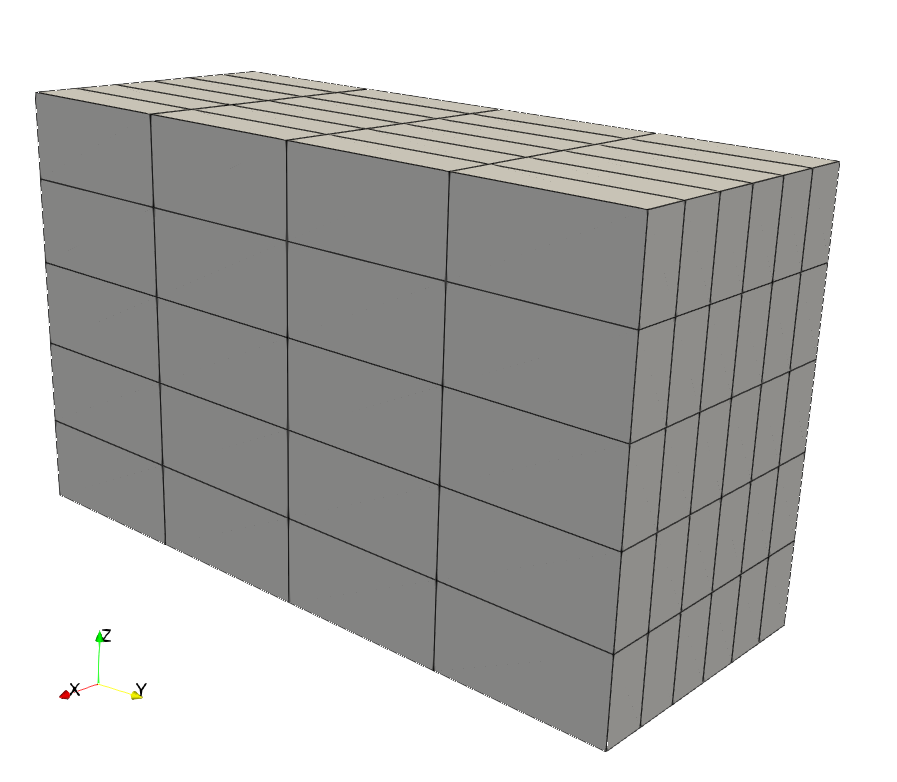
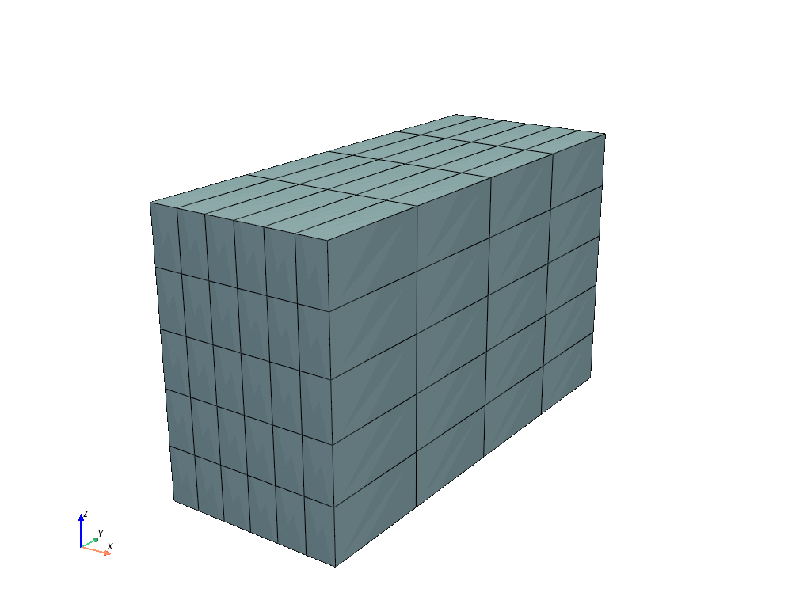
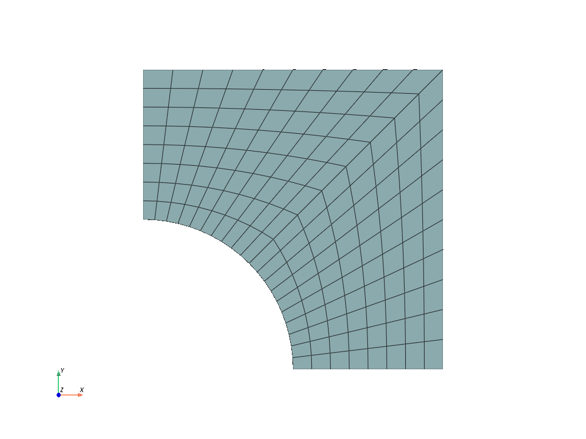
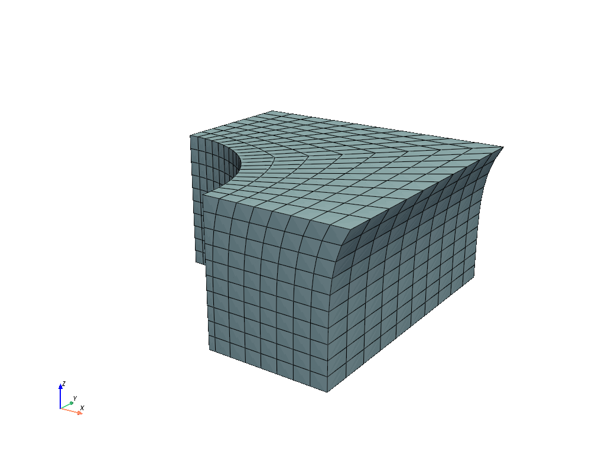
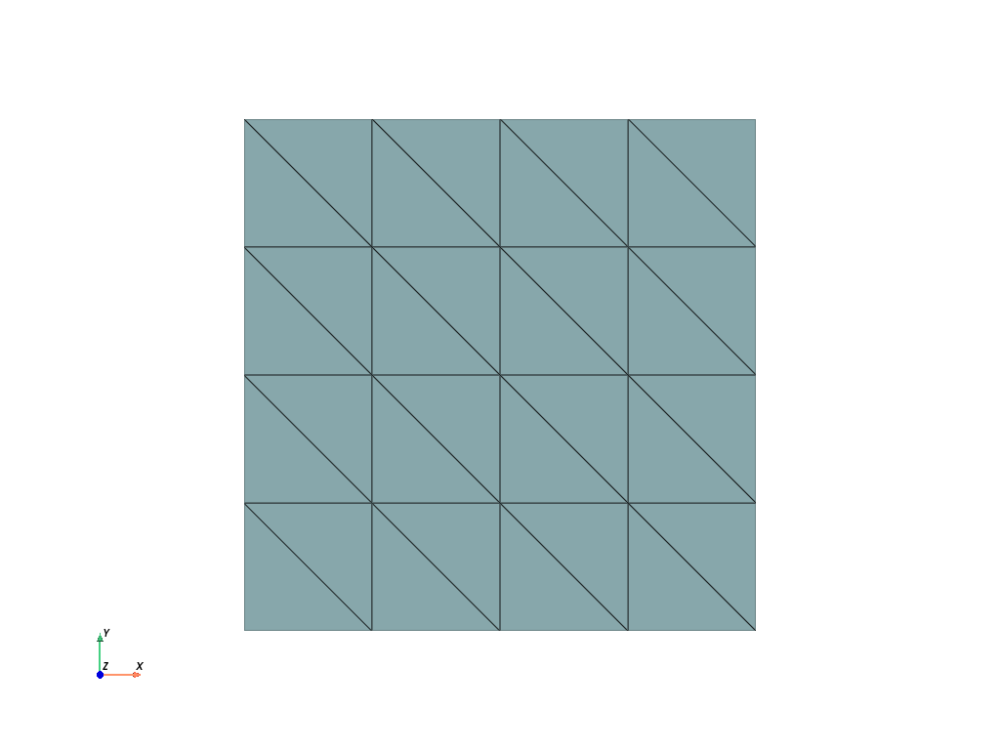
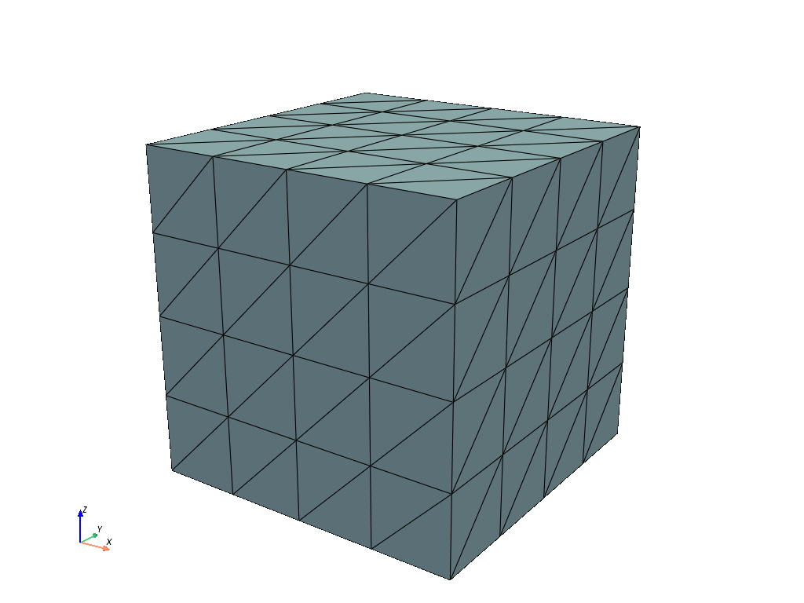
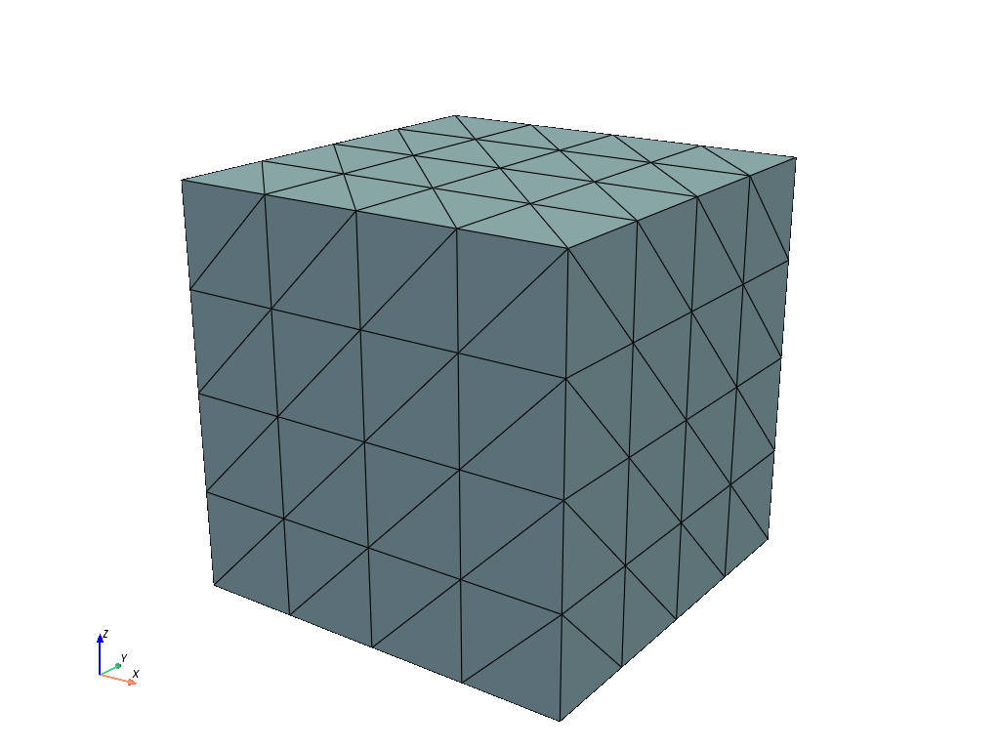

Generate Meshes
~~~~~~~~~~~~~~~

FElupe provides a simple mesh generation module :mod:`felupe.mesh`. A :class:`felupe.Mesh` instance contains essentially two arrays: one with ``points`` and another one containing the cell connectivities, called ``cells``. Only a single ``cell_type`` is supported per mesh. Optionally the ``cell_type`` is specified which is used if the mesh is saved as a VTK or a XDMF file. These cell types are identical to cell types used in meshio (`VTK types <https://vtk.org/doc/nightly/html/vtkCellType_8h_source.html>`_): ``line``, ``quad`` and ``hexahedron`` for linear lagrange elements or ``triangle`` and  ``tetra`` for 2- and 3-simplices or ``VTK_LAGRANGE_HEXAHEDRON`` for 3d lagrange-cells with polynomial shape functions of arbitrary order.

..  code-block:: python

    import numpy as np
    import felupe as fem

    points = np.array([
        [ 0, 0], # point 1
        [ 1, 0], # point 2
        [ 0, 1], # point 3
        [ 1, 1], # point 4
    ], dtype=float)

    cells = np.array([
        [ 0, 1, 3, 2], # point-connectivity of first cell
    ])

    mesh = fem.Mesh(points, cells, cell_type="quad")

    # view the mesh in an interactive window
    fem.ViewMesh(mesh).plot().show()
    
    # take a screenshot of an off-screen view
    img = fem.ViewMesh(mesh).plot(off_screen=True).screenshot(
        "mesh.png", 
        transparent_background=True,
    )

A cube by hand
**************

First let's start with the generation of a line from ``x=1`` to ``x=3`` with ``n=2`` points. Next, the line is expanded into a rectangle. The ``z`` argument of :func:`felupe.mesh.expand` represents the total expansion. Again, an expansion of our rectangle leads to a hexahedron. Several other useful functions are available beside :func:`felupe.mesh.expand`: :func:`felupe.mesh.rotate`, :func:`felupe.mesh.revolve` and :func:`felupe.mesh.sweep`. With these simple tools at hand, rectangles, cubes or cylinders may be constructed with ease.

..  code-block:: python

    line = fem.mesh.Line(a=1, b=3, n=7)
    rect = fem.mesh.expand(line, n=5, z=5)
    cube = fem.mesh.expand(rect, n=6, z=3)

Alternatively, these mesh-related tools are also provided as methods of a :class:`felupe.Mesh`.

..  code-block:: python

    cube = fem.mesh.Line(a=1, b=3, n=7).expand(n=5, z=5).expand(n=6, z=3)

Lines, rectangles and cubes
***************************

Of course lines, rectangles, cubes and cylinders do not have to be constructed manually each time. Instead, some easier to use classes are povided by FElupe like :class:`felupe.mesh.Line`, :class:`felupe.Rectangle` or :class:`felupe.Cube`. For non equi-distant points per axis use :class:`felupe.Grid`.

..  code-block:: python

    cube = fem.Cube(a=(1, 0, 0), b=(3, 5, 3), n=(7, 5, 6))

Cylinders
*********

Cylinders are created by a revolution of a rectangle.

..  code-block:: python

    r = 25
    R = 50
    H = 100
    
    rect = fem.Rectangle(a=(r, 0), b=(R, H), n=(11, 41))
    cylinder = rect.revolve(n=19, phi=180, axis=1)

Fill between boundaries
***********************

Meshed boundaries may be used to fill the area or volume in between for line and quad meshes. A plate with a hole is initiated by a line mesh, which is copied two times for the boundaries. The points arrays are updated for the hole and the upper edge. The face is filled by a quad mesh.

..  code-block:: python

    n = (11, 9)
    phi = np.linspace(1, 0.5, n[0]) * np.pi / 2
    
    line = fem.mesh.Line(n=n[0])
    bottom = line.copy(points=0.5 * np.vstack([np.cos(phi), np.sin(phi)]).T)
    top = line.copy(
        points=np.vstack([np.linspace(0, 1, n[0]), np.linspace(1, 1, n[0])]).T
    )
    
    face = bottom.fill_between(top, n=n[1])
    mesh = fem.mesh.concatenate([face, face.mirror(normal=[-1, 1, 0])]).sweep()

Indentations for rubber-metal parts
***********************************

Typical indentations (runouts) of the free-rubber surfaces in rubber-metal components are defined by a centerpoint, an axis and their relative amounts (values) per axis. Optionally, the transformation of the point coordinates is restricted to a list of given points.

..  code-block:: python

    block = mesh.expand(z=0.5)
    x, y, z = block.points.T
    
    solid = block.add_runouts(
        centerpoint=[0, 0, 0], 
        axis=2,
        values=[0.07, 0.02],
        exponent=5,  # shape parameter
        normalize=True,
        mask=np.arange(solid.npoints)[np.sqrt(x**2 + y**2) > 0.5]
    )

Triangle and Tetrahedron meshes
*******************************

Any quad or tetrahedron mesh may be subdivided (triangulated) to meshes out of Triangles or Tetrahedrons by :func:`felupe.mesh.triangulate`.

..  code-block:: python

    rectangle = fem.Rectangle(n=5).triangulate()

..  code-block:: python

    cube = fem.Cube(n=5).triangulate()

..  code-block:: python

    cube = fem.Cube(n=5).triangulate(mode=0)

Meshes with midpoints
*********************

If a mesh with midpoints is required by a region, functions for edge, face and volume midpoint insertions are provided in :func:`felupe.mesh.add_midpoints_edges`, :func:`felupe.mesh.add_midpoints_faces` and :func:`felupe.mesh.add_midpoints_volumes`. A low-order mesh, e.g. a mesh with cell-type `quad`, can be converted to a quadratic mesh with :func:`felupe.mesh.convert`. By default, only midpoints on edges are inserted. Hence, the resulting cell-type is ``quad8``. If midpoints on faces are also calculated, the resulting cell-type is ``quad9``.

..  code-block:: python
    
    rectangle_quad4 = fem.Rectangle(n=6)
    rectangle_quad8 = rectangle_quad4.convert(order=2)
    rectangle_quad9 = fem.mesh.convert(rectangle_quad4, order=2, calc_midfaces=True)

The same also applies on meshes with triangles.

..  code-block:: python

    rectangle_triangle3 = fem.Rectangle(n=6).triangulate()
    rectangle_triangle6 = rectangle_triangle3.add_midpoints_edges()

While views on higher-order meshes are possible, it is suggested to use ParaView for the visualization of meshes with midpoints due to the improved representation of the cells.