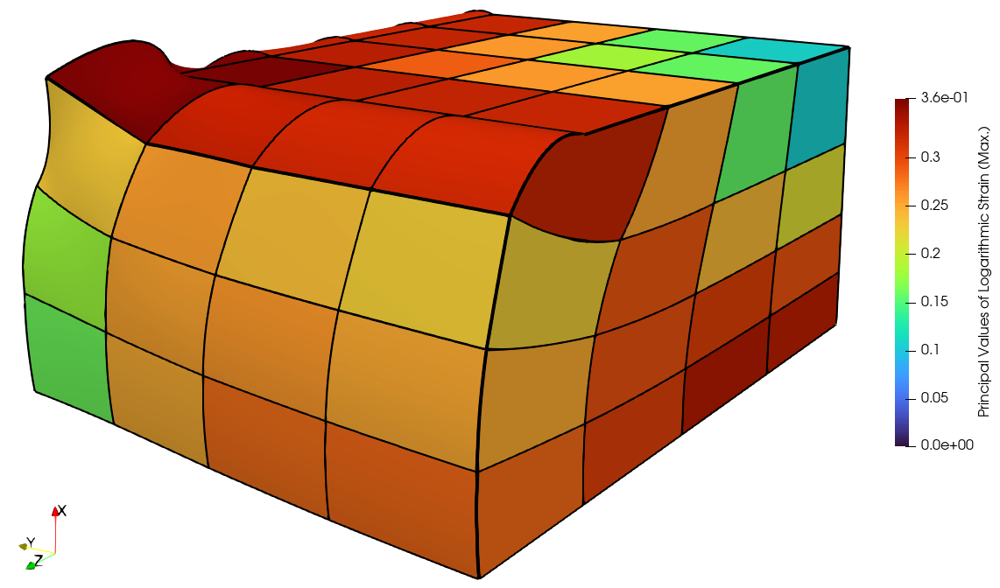

Mixed-Field Problems
~~~~~~~~~~~~~~~~~~~~

FElupe supports mixed-field formulations in a similar way it can handle (default) single-field formulations. The definition of a mixed-field formulation is shown for the hydrostatic-volumetric selective three-field-variation with independend fields for displacements :math:`\boldsymbol{u}`, pressure :math:`p` and volume ratio :math:`J`. The total potential energy for nearly-incompressible hyperelasticity is formulated with a determinant-modified deformation gradient. The built-in Neo-Hookean material model is used as an argument of :class:`felupe.ThreeFieldVariation` for mixed-field problems.

..  code-block:: python

    import felupe as fem

    neohooke = fem.constitution.NeoHooke(mu=1.0, bulk=5000.0)
    umat = fem.constitution.ThreeFieldVariation(neohooke)

Next, let's create a meshed cube. Two regions, one for the displacements and another one for the pressure and the volume ratio are created.

..  code-block:: python

    mesh  = fem.Cube(n=6)

    region  = fem.RegionHexahedron(mesh)
    region0 = fem.RegionConstantHexahedron(mesh)

    dV = region.dV

    displacement = fem.Field(region,  dim=3)
    pressure     = fem.Field(region0, dim=1)
    volumeratio  = fem.Field(region0, dim=1, values=1)

    field = fem.FieldContainer(fields=[displacement, pressure, volumeratio])

Boundary conditions are enforced on the displacement field.

..  code-block:: python

    import numpy as np

    f1 = lambda x: np.isclose(x, 1)

    boundaries = fem.dof.symmetry(displacement)
    boundaries["right"] = fem.Boundary(displacement, fx=f1, skip=(1, 0, 0))
    boundaries["move" ] = fem.Boundary(displacement, fx=f1, skip=(0, 1, 1), value=-0.4)

    dof0, dof1 = fem.dof.partition(field, boundaries)
    ext0 = fem.dof.apply(field, boundaries, dof0)

The Newton-Rhapson iterations are coded quite similar. For mixed-fields, FElupe assumes that the first field operates on the gradient and all the others don't. The resulting system vector with incremental values of the fields has to be splitted at the field-offsets in order to update the fields.

..  code-block:: python

    for iteration in range(8):

        F, p, J = field.extract()
        
        linearform = fem.IntegralForm(umat.gradient([F, p, J])[:-1], field, dV)
        bilinearform = fem.IntegralForm(umat.hessian([F, p, J]), field, dV, field)

        r = linearform.assemble().toarray()[:, 0]
        K = bilinearform.assemble()
        
        system = fem.solve.partition(field, K, dof1, dof0, r)
        dfield = np.split(fem.solve.solve(*system, ext0), field.offsets)
        
        field += dfield

        norm = np.linalg.norm(dfield[0])
        print(iteration, norm)

        if norm < 1e-12:
            break

    fem.tools.save(region, field, filename="result.vtk")

The deformed cube is finally visualized by a VTK output file with the help of Paraview.

