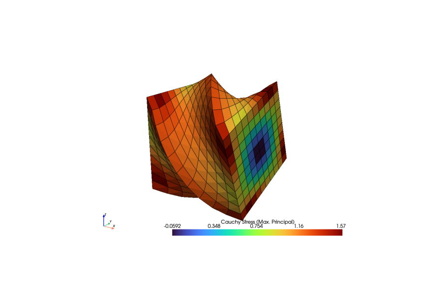
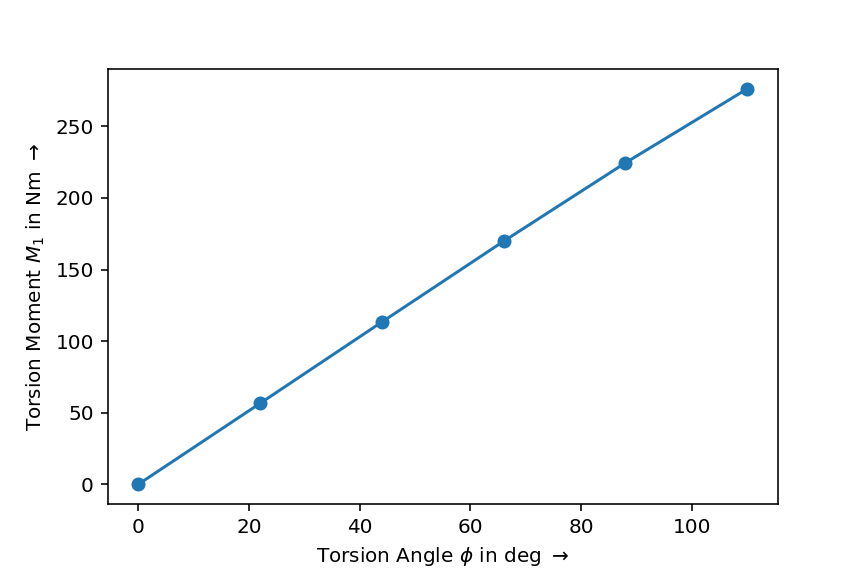

Torsion Boundary
~~~~~~~~~~~~~~~~

This section demonstrates how to create a :class:`~felupe.Boundary` for torsional loading. This is somewhat more complicated than a simple boundary condition with identical mesh-point values because the values of the mesh-points are different. However, this is not a problem. FElupe supports arrays to be passed as the ``value``-argument of a :class:`~felupe.Boundary`. This is even possible in a :class:`~felupe.Step` with the ``ramp``-argument.

..  code-block:: python

    import numpy as np
    import felupe as fem

    mesh = fem.Cube(n=11, b=(100, 100, 100))
    region = fem.RegionHexahedron(mesh)
    field = fem.FieldContainer([fem.Field(region, dim=3)])

    boundaries = {
        "fixed": fem.dof.Boundary(field[0], fx=0),
        "top": fem.dof.Boundary(field[0], fx=100),
    }
    umat = fem.NeoHooke(mu=1, bulk=2)
    solid = fem.SolidBody(umat, field)

    angles_deg = np.linspace(0, 110, 6)
    move = []

    for phi in angles_deg:
        top = mesh.points[boundaries["top"].points]
        top_rotated = fem.mesh.rotate(
            points=top,
            cells=None,
            cell_type=None,
            angle_deg=phi,
            axis=0,
            center=[100, 50, 50],
        )[0]
        move.append((top_rotated - top).ravel())

The reaction moment on the centerpoint of the right end face is tracked by a ``callback()`` function when we :meth:`~felupe.Job.evaluate` the :class:`~felupe.Job`.

..  code-block:: python

    moment = []

    def callback(i, j, substep):
        "Evaluate the reaction moment at the centerpoint of the right end face."
        forces = substep.fun
        M = fem.tools.moment(field, forces, boundaries["top"], centerpoint=[100, 50, 50])
        moment.append(M)

    step = fem.Step(items=[solid], ramp={boundaries["top"]: move}, boundaries=boundaries)

    job = fem.Job(steps=[step], callback=callback)
    job.evaluate()
    solid.plot("Principal Values of Cauchy Stress", show_undeformed=False).show()

Finally, let's plot the reaction moment vs. torsion angle curve.

..  code-block:: python

    import matplotlib.pyplot as plt

    fig, ax = plt.subplots()
    ax.plot(angles_deg, np.array(moment)[:, 0] / 1000, "o-")
    ax.set_xlabel(r"Torsion Angle $\phi$ in deg $\rightarrow$")
    ax.set_ylabel(r"Torsion Moment $M_1$ in Nm $\rightarrow$")

