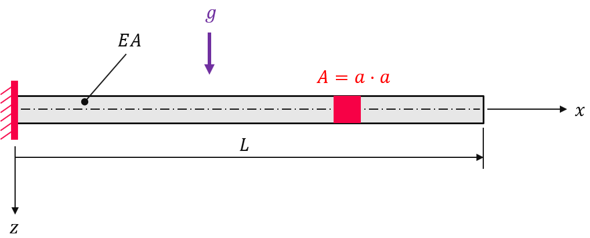
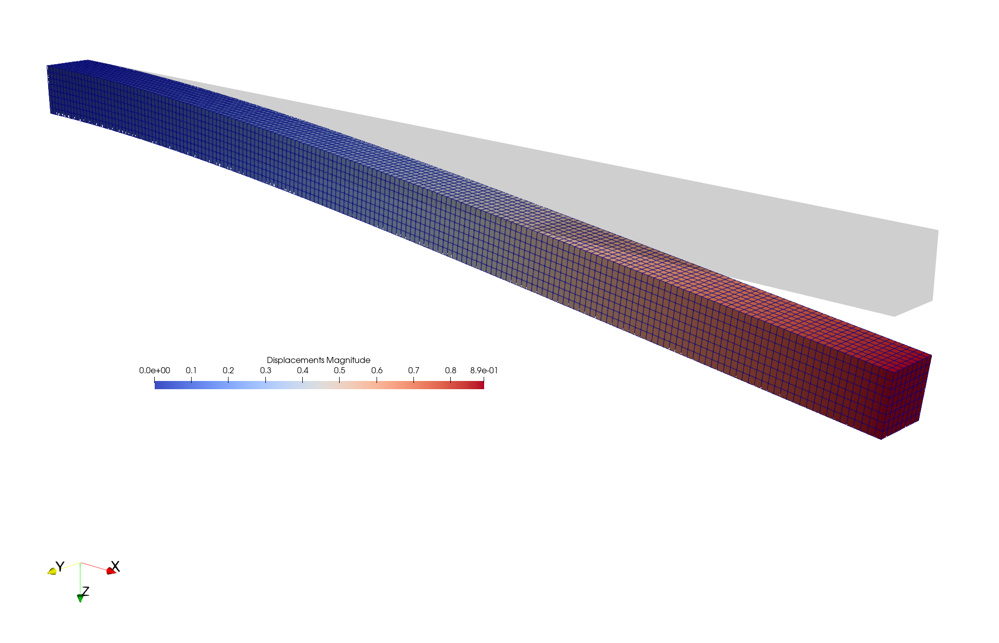

Cantilever beam under gravity
-----------------------------

.. admonition:: Assemble a body force vector due to gravity.
   :class: note

   * define the body force vector
   
   * linear-elastic analysis

The displacement due to gravity of a cantilever beam with young's modulus :math:`E=206000 N/mm^2`, poisson ratio :math:`\nu=0.3`, length :math:`L=2000 mm` and cross section area :math:`A=a \cdot a` with :math:`a=100 mm` is to be evaluated within a linear-elastic analysis.

First, let's create a meshed cube out of hexahedron cells with ``n=(181, 9, 9)`` points per axis. A numeric region created on the mesh represents the cantilever beam. A vector-valued displacement field is initiated on the region.

..  code-block:: python

    import numpy as np
    import felupe as fe

    cube = fe.Cube(a=(0, 0, 0), b=(2000, 100, 100), n=(181, 9, 9))
    region = fe.RegionHexahedron(cube)
    displacement = fe.Field(region, dim=3)
    field = fe.FieldContainer([displacement])

A fixed boundary condition is applied on the left end of the beam. The degrees of freedom are partitioned into active (``dof1``) and fixed or inactive (``dof0``) degrees of freedom.

..  code-block:: python

    bounds = {"fixed": fe.dof.Boundary(displacement, fx=lambda x: x==0)}
    dof0, dof1 = fe.dof.partition(field, bounds)

The material behavior is defined through a built-in isotropic linear-elastic material formulation.

..  code-block:: python

    umat = fe.LinearElastic(E=206000, nu=0.3)
    density = 7850 * 1e-12

The body force is now assembled. Note that the gravity vector has to be reshaped for shape compatibility.

..  math::

    \delta W_{ext} = \int_v \delta \boldsymbol{u} \cdot \rho \boldsymbol{g} ~ dv

..  code-block:: python

    gravity = np.array([0, 0, 9.81]) * 1e3

    bodyforce = fe.IntegralForm(
        fun=[density * gravity.reshape(-1, 1, 1)], 
        v=field, 
        dV=region.dV,
        grad_v=[False]
    ).assemble()

The weak form of linear elasticity is assembled into the stiffness matrix, where the constitutive elasticity matrix is generated with :func:`umat.elasticity`.

.. math::

   \delta W_{int} = - \int_v \delta \boldsymbol{\varepsilon} : \mathbb{C} : \boldsymbol{\varepsilon} \ dv

..  code-block:: python
    
    stiffness = fe.IntegralForm(
        fun=umat.elasticity(region=region), 
        v=field, 
        dV=region.dV, 
        u=field, 
    ).assemble(parallel=True)

The linear equation system may now be solved. First, a partition into active and inactive degrees of freedom is performed. This partitioned system is then passed to the solver. The maximum displacement is identical to the one obtained in `[1] <https://www.doi.org/10.5545/sv-jme.2017.5081>`_.

..  code-block:: python

    system = fe.solve.partition(field, stiffness, dof1, dof0, r=-bodyforce)
    field += fe.solve.solve(*system)

    fe.save(region, field, filename="bodyforce.vtk")

References
~~~~~~~~~~

`[1] <https://www.doi.org/10.5545/sv-jme.2017.5081>`_ Glenk C. et al., *Consideration of Body Forces within Finite Element Analysis,* Strojniški vestnik - Journal of Mechanical Engineering, Faculty of Mechanical Engineering, 2018, |DOI|

.. |DOI| image:: https://zenodo.org/badge/DOI/10.5545/sv-jme.2017.5081.svg
   :target: https://www.doi.org/10.5545/sv-jme.2017.5081