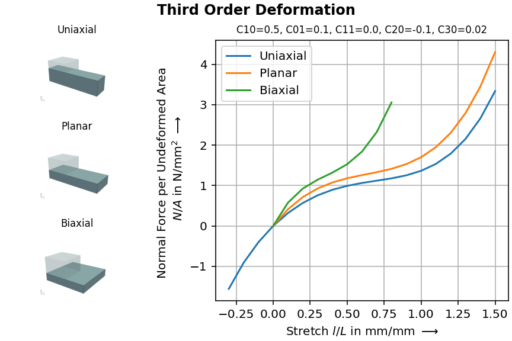
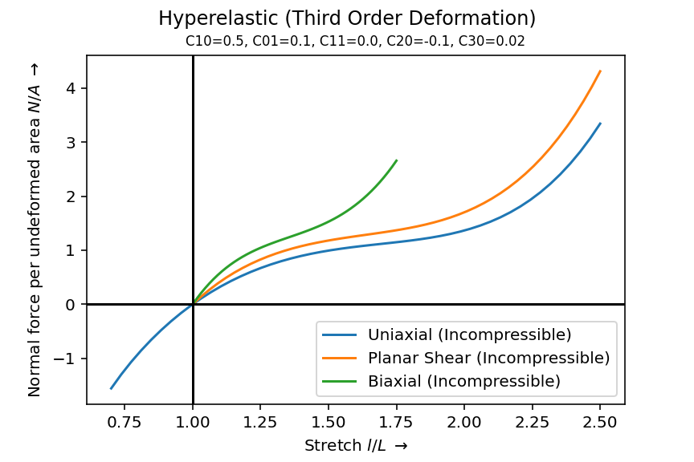

.. _tutorial-elementary-deformations:

Elementary Deformations
-----------------------

..  admonition:: Combine views on deformed meshes and force-displacement curves in a single figure.
    :class: note

    * load a hyperelastic material formulation
    
    * create a meshed cube with hexahedron cells
    
    * define a numeric region along with a displacement field

    * apply uniaxial, planar and biaxial loadcases
    
    * solve the problems
    
    * plot force-displacement curves

In this tutorial you'll learn how to plot multiple force-displacement curves along with views on deformed meshes in one single matplotlib figure. We start with a :class:`Third-Order-Deformation <felupe.third_order_deformation>` isotropic hyperelastic material formulation. :class:`~felupe.Hyperelastic` provides a :meth:`~felupe.Hyperelastic.plot`-method to preview force-stretch curves on incompressible elementary deformations.

..  code-block:: python

    import felupe as fem

    strain_energy_function = fem.third_order_deformation
    kwargs = dict(C10=0.5, C01=0.1, C11=0.0, C20=-0.1, C30=0.02)

    umat = fem.Hyperelastic(strain_energy_function, **kwargs)
    ax = umat.plot(incompressible=True)

We'd like to generate force-displacement characteristic curves for the elementary homogeneous deformations :func:`uniaxial <felupe.dof.uniaxial>`, :func:`planar <felupe.dof.biaxial>` and :func:`biaxial <felupe.dof.biaxial>` obtained by simulations using the finite element method. Therefore, let's define a meshed :class:`~felupe.Cube` with one :class:`hexahedron <felupe.Hexahedron>` cell and a :class:`region <felupe.RegionHexahedron>`. One cell is enough because the deformation is identical inside the solid body, i.e. it is said to be homogeneous.

..  code-block:: python

    mesh = fem.Cube(n=2)
    region = fem.RegionHexahedron(mesh)

We also need to initiate a matplotlib :class:`~matplotlib.figure.Figure` with multiple subplots.

..  code-block:: python

    import matplotlib.pyplot as plt

    fig, ax = plt.subplot_mosaic(
        [["upper left", "right"], ["middle left", "right"], ["lower left", "right"]],
        layout="constrained",
        figsize=(6, 4),
        gridspec_kw=dict(width_ratios=[1, 2]),
    )

The force-displacement curve is tracked and :meth:`plotted <felupe.CharacteristicCurve.plot>` during :meth:`evaluation <felupe.Job.evaluate>` of a :class:`~felupe.CharacteristicCurve`-job for a :func:`uniaxial <felupe.dof.uniaxial>` compression/tension load case.

..  code-block:: python

    field = fem.FieldContainer([fem.Field(region, dim=3)])
    boundaries, loadcase = fem.dof.uniaxial(field)
    solid = fem.SolidBodyNearlyIncompressible(umat, field, bulk=5000)
    uniaxial = fem.math.linsteps([-0.3, 0, 1.5], num=[3, 15])
    step = fem.Step(
        items=[solid], ramp={boundaries["move"]: uniaxial}, boundaries=boundaries
    )
    job = fem.CharacteristicCurve(steps=[step], boundary=boundaries["move"]).evaluate()

    field.imshow(ax=ax["upper left"])
    ax["upper left"].set_title("Uniaxial", fontdict=dict(fontsize="small"))

    fig, ax["right"] = job.plot(
        xlabel="Stretch $l/L$ in mm/mm $\longrightarrow$",
        ylabel="Normal Force per Undeformed Area \n $N/A$ in N/mm$^2$ $\longrightarrow$",
        label="Uniaxial",
        ax=ax["right"],
    )

These force-displacement curves are also evaluated for :func:`planar <felupe.dof.biaxial>` (shear) tension...

..  code-block:: python

    field = fem.FieldContainer([fem.Field(region, dim=3)])
    boundaries, loadcase = fem.dof.biaxial(field, moves=(0, 0))
    solid = fem.SolidBodyNearlyIncompressible(umat, field, bulk=5000)
    planar = fem.math.linsteps([0, 1.5], num=15)
    step = fem.Step(
        items=[solid], ramp={boundaries["move-right-0"]: planar}, boundaries=boundaries
    )
    job = fem.CharacteristicCurve(
        steps=[step], boundary=boundaries["move-right-0"]
    ).evaluate()

    field.imshow(ax=ax["middle left"])
    ax["middle left"].set_title("Planar", fontdict=dict(fontsize="small"))

    fig, ax["right"] = job.plot(ax=ax["right"], label="Planar")

...and equi-:func:`biaxial <felupe.dof.biaxial>` tension. When we plot the planar and biaxial force-displacement curves, the ``ax["right"]``-object already has x- and y-labels defined and we only need to set the line labels accordingly.

..  code-block:: python

    field = fem.FieldContainer([fem.Field(region, dim=3)])
    boundaries, loadcase = fem.dof.biaxial(field)
    solid = fem.SolidBodyNearlyIncompressible(umat, field, bulk=5000)
    biaxial = fem.math.linsteps([0, 0.8], num=8)
    step = fem.Step(
        items=[solid],
        ramp={boundaries["move-right-0"]: biaxial, boundaries["move-right-1"]: biaxial},
        boundaries=boundaries,
    )
    job = fem.CharacteristicCurve(
        steps=[step], boundary=boundaries["move-right-0"]
    ).evaluate()

    field.imshow(ax=ax["lower left"])
    ax["lower left"].set_title("Biaxial", fontdict=dict(fontsize="small"))

    fig, ax["right"] = job.plot(ax=ax["right"], label="Biaxial")

Finally, let's add the name and the parameters of the :class:`Third-Order-Deformation <felupe.third_order_deformation>` material formulation to the title of the figure.

..  code-block:: python

    title = " ".join([name.title() for name in fun.__name__.split("_")])
    ax["right"].set_title(
        ", ".join([f"{key}={value}" for key, value in kwargs.items()]),
        fontdict=dict(fontsize="small"),
    )
    fig.suptitle(title, weight="bold")
    ax["right"].legend()
    ax["right"].grid()

If the data of the force-displacement curves is needed for the calibration of the material parameters on given experimentally determined force-displacement curves, the data may be extracted from the figure.

..  code-block:: python

    data = [(line.get_xdata(), line.get_ydata()) for line in ax["right"].lines]
