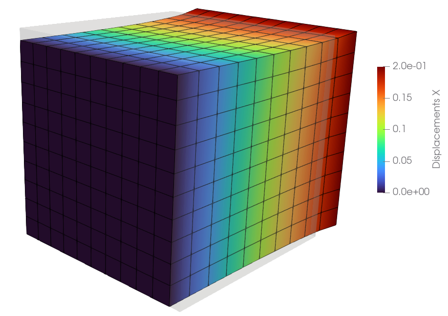

.. _tutorial-getting-started:

Getting Started
---------------

..  admonition:: Your very first steps with FElupe.
    :class: note
    
    * create a meshed cube with hexahedron cells
    
    * define a numeric region along with a displacement field
    
    * load a Neo-Hookean material formulation
    
    * apply a uniaxial loadcase
    
    * solve the problem
    
    * export the displaced mesh

This tutorial covers the essential high-level parts of creating and solving problems with FElupe. As an introductory example, a quarter model of a solid cube with hyperelastic material behaviour is subjected to a uniaxial elongation applied at a clamped end-face. First, let's import FElupe and create a meshed cube out of hexahedron cells with ``n=11`` points per axis. A numeric region, pre-defined for hexahedrons, is created on the mesh. A vector-valued displacement field is initiated on the region. Next, a field container is created on top of the displacement field.

..  code-block:: python

    import felupe as fem
    
    mesh = fem.Cube(n=11)
    region = fem.RegionHexahedron(mesh=mesh)
    displacement = fem.Field(region=region, dim=3)
    field = fem.FieldContainer(fields=[displacement])

A uniaxial load case is applied on the displacement field stored inside the field container. This involves setting up symmetry planes as well as the absolute value of the prescribed displacement at the mesh-points on the right-end face of the cube. The right-end face is *clamped*: only displacements in direction x are allowed. The dict of boundary conditions for this pre-defined load case are returned as ``boundaries`` and the partitioned degrees of freedom as well as the external displacements are stored within the returned dict ``loadcase``.

..  code-block:: python

    boundaries, loadcase = fem.dof.uniaxial(field, move=0.2, right=1, clamped=True)

The material behaviour is defined through a built-in Neo-Hookean material formulation. The constitutive isotropic hyperelastic material formulation is applied on the displacement field by the definition of a solid body.

..  code-block:: python

    umat = fem.NeoHooke(mu=1.0, bulk=2.0)
    body = fem.SolidBody(umat=umat, field=field)

The problem is solved by an iterative `Newton-Rhapson`_ procedure.

..  code-block:: python

    res = fem.newtonrhapson(items=[body], **loadcase)

..  code-block:: markdown
    
    Newton-Rhapson solver
    =====================

    | # | norm(fun) |  norm(dx) |
    |---|-----------|-----------|
    | 1 | 7.587e-02 | 4.622e+00 |
    | 2 | 1.580e-03 | 1.215e-01 |
    | 3 | 4.230e-07 | 1.478e-03 |
    | 4 | 5.482e-14 | 3.308e-07 |

    Converged in 4 iterations (Assembly: 0.5824 s, Solve: 1.082 s).

Results are saved within a VTK-file and have to be analyzed in a third-party VTK-viewer (e.g. ParaView) or are to be viewed directly in an interactive window.
    
..  code-block:: python

    fem.save(region, field, filename="result.vtk")
    fem.View(field).plot("Displacement", component=0).show()

..  _Newton-Rhapson: https://en.wikipedia.org/wiki/Newton%27s_method
