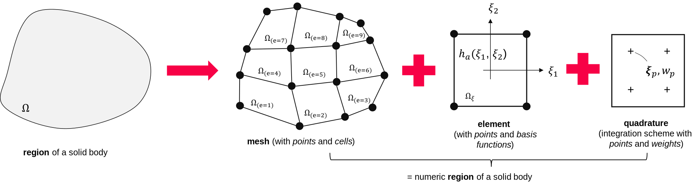
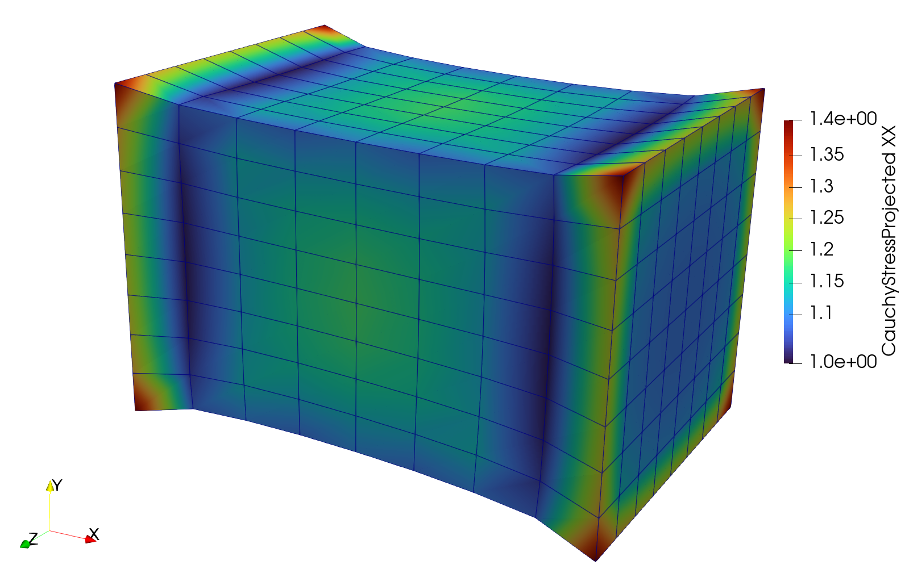

Getting started
---------------

.. admonition:: Have a look at the building blocks of FElupe.
   :class: note

   * create a meshed cube with hexahedron elements
   
   * setup your own numeric region with a mesh, an element and a quadrature
   
   * add a displacement field
   
   * define your own Neo-Hookean material formulation
   
   * apply your own boundary conditions
   
   * solve the problem (create your own Newton-Rhapson iteration loop)
   
   * export the displaced mesh along with cauchy stress projected to mesh-points

Start setting up a problem in FElupe by the creation of a numeric **Region** with a geometry (**Mesh**), a finite **Element** and a **Quadrature** rule, e.g. for hexahedrons or tetrahedrons. By using a template region like `RegionHexahedron` (see section **Region**), only the mesh has to be created.

..  code-block:: python

    mesh = felupe.Cube(n=9)
    element = felupe.Hexahedron()
    quadrature = felupe.GaussLegendre(order=1, dim=3)

Region
~~~~~~

A region essentially pre-calculates element shape functions and derivatives evaluated at every quadrature point of every cell w.r.t. the undeformed coordinates (as attribute `dhdX`). An array containing products of quadrature weights multiplied by the determinants of the (geometric) jacobians is stored as the differential volume. The sum of all differential volumes gives the total (undeformed) volume of the region. The attributes of a region are used in a `Field`.

..  code-block:: python

    region = felupe.Region(mesh, element, quadrature)
    # region = felupe.RegionHexahedron(mesh)

    dV = region.dV
    V = dV.sum()

.. image:: images/undeformed_mesh.png
   :width: 600px

Field
~~~~~

In a second step fields may be added to the Region which may be either scalar or vector fields. The values at mesh-points are obtained with the attribute ``values``. Interpolated field values at quadrature points are calculated with the ``interpolate()`` method. Additionally, the displacement gradient w.r.t. the undeformed coordinates is calculated for every quadrature point of every cell in the region with the field method ``grad()``. A generalized extraction method ``extract(grad=True, add_identity=True, sym=False)`` allows several arguments to be passed. This involves or whether the gradient or the values are extracted. If the gradient is extracted, the identity matrix may be added to the gradient (useful for the calculation of the deformation gradient). Optionally, the symmetric part is returned (small strain tensor).

..  code-block:: python

    displacement = felupe.Field(region, dim=3)

    u    = displacement.values
    ui   = displacement.interpolate()
    dudX = displacement.grad()

The deformation gradient is obtained by a sum of the identity and the displacement gradient.

..  code-block:: python

    F = displacement.extract(grad=True, sym=False, add_identity=True)

Constitution
~~~~~~~~~~~~

The material behavior has to be provided by the first Piola-Kirchhoff stress tensor as a function of the deformation gradient. FElupe provides a very basic constitutive library (Neo-Hooke, linear elasticity and a Hu-Washizu (u,p,J) three field variation). Alternatively, an isotropic material formulation is defined by a strain energy density function - both variation (stress) and linearization (elasticity) are carried out by automatic differentiation using `matadi <https://github.com/adtzlr/matadi)>`_. The latter one is demonstrated here with a nearly-incompressible version of the Neo-Hookean material model.

.. math::

   \psi = \frac{\mu}{2} \left( J^{-2/3} \text{tr}\boldsymbol{C} - 3 \right) + \frac{K}{2} \left( J - 1 \right)^2

..  code-block:: python

    import matadi
    from matadi.math import det, transpose, trace

    def W(F, mu, bulk):
        "Neo-Hooke"

        J = det(F)
        C = transpose(F) @ F

        return mu/2 * (J**(-2/3)*trace(C) - 3) + bulk/2 * (J - 1)**2

    umat = matadi.MaterialHyperelastic(W, mu=1.0, bulk=2.0)

    P = umat.gradient
    A = umat.hessian

Boundary Conditions
~~~~~~~~~~~~~~~~~~~

Next we enforce boundary conditions on the displacement field. Boundary conditions are stored as a dictionary of multiple boundary instances. First, the left end of the cube is fixed. Displacements on the right end are fixed in directions y and z whereas displacements in direction x are prescribed with a user-defined value. A boundary instance hold useful attributes like ``points`` or ``dof``.

..  code-block:: python
    
    import numpy as np

    f0 = lambda x: np.isclose(x, 0)
    f1 = lambda x: np.isclose(x, 1)

    boundaries = {}
    boundaries["left"]  = felupe.Boundary(displacement, fx=f0)
    boundaries["right"] = felupe.Boundary(displacement, fx=f1, skip=(1,0,0))
    boundaries["move"]  = felupe.Boundary(displacement, fx=f1, skip=(0,1,1), value=0.5)

Partition of deegrees of freedom
~~~~~~~~~~~~~~~~~~~~~~~~~~~~~~~~

The separation of active and inactive degrees of freedom is performed by a so-called **partition**. External values of prescribed displacement degrees of freedom are obtained by the application of the boundary values to the displacement field.

..  code-block:: python
    
    dof0, dof1 = felupe.dof.partition(displacement, boundaries)
    u0ext = felupe.dof.apply(displacement, boundaries, dof0)

Integral forms of equilibrium equations
~~~~~~~~~~~~~~~~~~~~~~~~~~~~~~~~~~~~~~~

The integral (or weak) forms of equilibrium equations are defined by the :class:`felupe.IntegralForm` class. The pre-evaluated function of interest has to be passed as the `fun` argument whereas the virtual field as the ``v`` argument. By setting ``grad_v=True``, FElupe passes the gradient of the virtual field to the integral form. FElupe assumes a linear form if ``u=None`` (default) or creates a bilinear form if a field is passed to the field argument ``u``.

.. math::

   \int_V P_i^{\ J} : \frac{\partial \delta u^i}{\partial X^J} \ dV \qquad \text{and} \qquad \int_V \frac{\partial \delta u^i}{\partial X^J} : \mathbb{A}_{i\ k\ }^{\ J\ L} : \frac{\partial u^k}{\partial X^L} \ dV

..  code-block:: python

    linearform   = felupe.IntegralForm(P([F])[0], displacement, dV, grad_v=True)
    bilinearform = felupe.IntegralForm(A([F])[0], displacement, dV, u=displacement, grad_v=True, grad_u=True)

Assembly of both forms lead to the (point-based) internal forces and the (sparse) stiffness matrix.

..  code-block:: python

    r = linearform.assemble().toarray()[:,0]
    K = bilinearform.assemble()

Prepare (partition) and solve the linearized equation system
~~~~~~~~~~~~~~~~~~~~~~~~~~~~~~~~~~~~~~~~~~~~~~~~~~~~~~~~~~~~

In order to solve the linearized equation system a partition into active and inactive degrees of freedom has to be performed. This system may then be passed to the (sparse direct) solver. Given a set of nonlinear equilibrium equations :math:`\boldsymbol{g}` the unknowns :math:`\boldsymbol{u}` are found by linearization at a valid initial state of equilibrium and an iterative Newton-Rhapson solution prodecure. The incremental values of inactive degrees of freedom are given as the difference of external prescribed and current values of unknowns. The (linear) solution is equal to the first result of a Newton-Rhapson iterative solution procedure. The resulting point values ``du`` are finally added to the displacement field. 

.. math::

   \boldsymbol{g}_1(\boldsymbol{u}) &= -\boldsymbol{r}_1(\boldsymbol{u}) + \boldsymbol{f}_1

   \boldsymbol{g}_1(\boldsymbol{u} + d\boldsymbol{u}) &\approx -\boldsymbol{r}_1 + \boldsymbol{f}_1 - \frac{\partial \boldsymbol{r}_1}{\partial \boldsymbol{u}_1} \ d\boldsymbol{u}_1 - \frac{\partial \boldsymbol{r}_1}{\partial \boldsymbol{u}_0} \ d\boldsymbol{u}_0 = \boldsymbol{0}

   d\boldsymbol{u}_0 &= \boldsymbol{u}_0^{(ext)} - \boldsymbol{u}_0

   \text{solve} \qquad \boldsymbol{K}_{11}\ d\boldsymbol{u}_1 &= \boldsymbol{g}_1 - \boldsymbol{K}_{10}\ d\boldsymbol{u}_{0}

   \boldsymbol{u}_0 &+= d\boldsymbol{u}_0

   \boldsymbol{u}_1 &+= d\boldsymbol{u}_1

The default solver of FElupe is `SuperLU <https://docs.scipy.org/doc/scipy/reference/generated/scipy.sparse.linalg.spsolve.html#scipy.sparse.linalg.spsolve>`_ provided by the sparse package of `SciPy <https://docs.scipy.org>`_. A significantly faster alternative is `pypardiso <https://pypi.org/project/pypardiso/>`_ which may be installed from PyPI with ``pip install pypardiso`` (not included with FElupe). The optional argument ``solver`` of :func:`felupe.solve.solve` accepts a user-defined solver.

..  code-block:: python

    from scipy.sparse.linalg import spsolve # default
    # from pypardiso import spsolve

    system = felupe.solve.partition(displacement, K, dof1, dof0, r)
    du = felupe.solve.solve(*system, u0ext, solver=spsolve).reshape(*u.shape)
    # displacement += du

A very simple newton-rhapson code looks like this:

..  code-block:: python

    for iteration in range(8):
        F = displacement.extract(grad=True, sym=False, add_identity=True)

        linearform = felupe.IntegralForm(P([F])[0], displacement, dV, grad_v=True)
        bilinearform = felupe.IntegralForm(
            A([F])[0], displacement, dV, displacement, grad_v=True, grad_u=True
        )

        r = linearform.assemble().toarray()[:, 0]
        K = bilinearform.assemble()

        system = felupe.solve.partition(displacement, K, dof1, dof0, r)
        du = felupe.solve.solve(*system, u0ext, solver=spsolve).reshape(*u.shape)

        norm = np.linalg.norm(du)
        print(iteration, norm)
        displacement += du

        if norm < 1e-12:
            break

..  code-block:: shell

    0 8.174180680860706
    1 0.2940958778404007
    2 0.02083230945148839
    3 0.0001028992534421267
    4 6.017153213511068e-09
    5 5.675484825228616e-16

All 3x3 components of the deformation gradient of integration point 1 of cell 1 (Python is 0-indexed) are obtained with

..  code-block:: python

    F[:,:,0,0]

..  code-block:: shell

    array([[ 1.49186831e+00, -1.17603278e-02, -1.17603278e-02],
           [ 3.09611695e-01,  9.73138551e-01,  8.43648336e-04],
           [ 3.09611695e-01,  8.43648336e-04,  9.73138551e-01]])

Export of results
~~~~~~~~~~~~~~~~~

Results are exported as VTK or XDMF files using `meshio <https://pypi.org/project/meshio/>`_.

..  code-block:: python

    felupe.save(region, displacement, filename="result.vtk")

Any tensor at quadrature points shifted or projected to, both averaged at mesh-points is evaluated for ``quad`` and ``hexahedron`` cell types by :class:`felupe.topoints` or :class:`felupe.project`, respectively. For example, the calculation of the cauchy stress involves the conversion from the first Piola-Kirchhoff stress to the Cauchy stress followed by the shift or the projection. The stress results at mesh points are passed as a dictionary to the ``point_data`` argument.

..  code-block:: python

    from felupe.math import dot, det, transpose

    s = dot(P([F])[0], transpose(F)) / det(F)

    cauchy_shifted = felupe.topoints(s, region)
    cauchy_projected = felupe.project(s, region)

    felupe.save(
        region, 
        displacement, 
        filename="result_with_cauchy.vtk", 
        point_data={
            "CauchyStressShifted": cauchy_shifted,
            "CauchyStressProjected": cauchy_projected,
        }
    )

