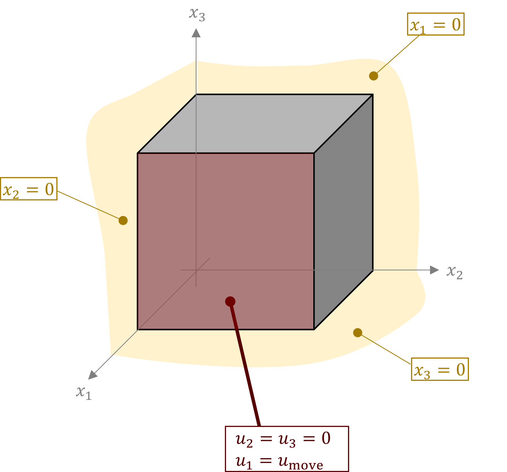

.. _tutorial-hello-felupe:

Hello, FElupe!
--------------

.. admonition:: Your very first steps with FElupe.
   :class: note

   * create a meshed cube with quad elements
   
   * define a numeric region along with a displacement field
   
   * load a Neo-Hookean material formulation
   
   * apply a uniaxial loadcase
   
   * solve the problem
   
   * export the displaced mesh

A quarter model of a solid cube with hyperelastic material behavior is subjected to a uniaxial elongation applied at a clamped end-face.

First, let's import FElupe and create a meshed cube out of hexahedron cells with ``n=11`` points per axis. A numeric region created on the mesh represents our solid body. A vector-valued displacement field is initiated on the region. Next, a field container is created on top of the displacement field.

..  code-block:: python

    import felupe as fe
    
    mesh = fe.Cube(n=11)
    region = fe.RegionHexahedron(mesh)
    displacement = fe.Field(region, dim=3)
    field = fe.FieldContainer([displacement])

A uniaxial loadcase is applied on the displacement field stored inside the field container. This involves setting up symmetry planes as well as the absolute value of the prescribed displacement at the mesh-points on the right-end face of the cube. The right-end face is clamped: only displacements in direction x are allowed.

..  code-block:: python

    boundaries, dof0, dof1, ext0 = fe.dof.uniaxial(field, move=0.2, clamped=True)

The material behavior is defined through a built-in Neo-Hookean material formulation. The  constitutive isotropic hyperelastic material formulation is applied on the displacement field by the definition of a solid body.

..  code-block:: python

    umat = fe.NeoHooke(mu=1.0, bulk=2.0)
    body = fe.SolidBody(umat=umat, field=field)

Inside a Newton-Rhapson procedure, the internal force vector and the tangent stiffness matrix are generated by assembling both linear and bilinear forms of static equilibrium. Finally, the solution of the incremental displacements is calculated und updated until convergence is reached.

..  code-block:: python

    res = fe.newtonrhapson(field, items=[body], dof1=dof1, dof0=dof0, ext0=ext0)

Results are saved as VTK-files.
    
..  code-block:: python

    fe.save(region, res.x, filename="result.vtk")

.. image:: images/readme.png
   :width: 600px