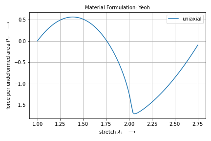
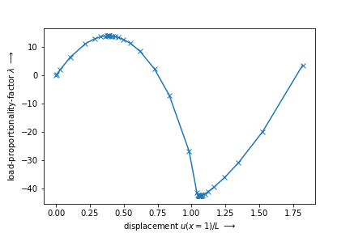

Numeric Continuation
--------------------

With the help of `pacopy <https://github.com/nschloe/pacopy>`_ (install with ``pip install pacopy``) it is possible to apply a numerical parameter continuation algorithm on any system of equilibrium equations. This advanced tutorial demonstrates the usage of FElupe in conjunction with pacopy. An unstable isotropic hyperelastic material formulation is applied on a single hexahedron. The model will be visualized by the XDMF-output (of meshio) and the resulting force - displacement curve will be plotted.

.. admonition:: Numeric continuation of a hyperelastic cube.
   :class: note

   * use FElupe with pacopy
   
   * on-the-fly XDMF-file export
   
   * plot force-displacement curve

..  raw:: html

    <video width="640" height="480" controls>
      <source src="../_static/animation.ogv" type="video/ogg">
    Your browser does not support the video tag.
    </video>

..  code-block:: python

    import numpy as np

    import felupe as fe
    import matadi as mat

    import pacopy
    import meshio

    import matplotlib.pyplot as plt

First, setup a problem as usual (mesh, region, field, boundaries and umat). For the material definition we use matADi (``pip install madati``). We use matADi's lab-capability to visualize the unstable material behavior in uniaxial tension.

..  code-block:: python

    # setup a numeric region on a cube
    region = fe.RegionHexahedron(fe.Cube(n=2))

    # add a vector-valued displacement field
    field = fe.Field(region, dim=3)

    # introduce symmetry planes at x=y=z=0
    bounds = fe.dof.symmetry(field, axes=(True, True, True))
    #bounds["left"] = fe.Boundary(field, fx=lambda x: x==0)

    # partition deegrees of freedom
    dof0, dof1 = fe.dof.partition(field, bounds)

    # constitutive isotropic hyperelastic material formulation
    yeoh = mat.MaterialHyperelastic(
        mat.models.yeoh, C10=0.5, C20=-0.25, C30=0.025, bulk=5
    )

    lab = mat.Lab(yeoh)
    data = lab.run(
        ux=True, 
        bx=False, 
        ps=False, 
        shear=False, 
        stretch_min=1,
        stretch_max=2.75,
        num=100,   
    )
    lab.plot(data)

    umat = fe.MatadiMaterial(yeoh)

An external normal force is applied at :math:`x=1` on quarter model of a cube with symmetry planes at :math:`x=y=z=0`. Therefore, we have to define an external load vector which will be scaled with the load-proportionality factor :math:`\lambda` during numeric continuation.

..  code-block:: python

    # external force vector at x=1
    f = np.zeros_like(region.mesh.points)
    right = region.mesh.points[:, 0] == 1
    f[right, 0] = 0.01 * region.mesh.cells_per_point[right]

    # dof of u_x at (x,y,z)=(1,0,0)
    p = 3 * np.arange(region.mesh.npoints)[
        np.all(region.mesh.points == [1, 0, 0], 1)
    ][0]

    # dof-number of p in active degrees of freedom `dof1`
    dofp = np.argwhere(dof1[np.isin(dof1, p)][0] == dof1)[0][0]

The next step involves the problem definition for pacopy. For details have a look at the `pacopy's README <https://github.com/nschloe/pacopy>`_.

..  code-block:: python

    class HyperelasticCube:
    
        def inner(self, a, b):
            return np.dot(a, b)
        
        def norm2_r(self, a):
            return np.dot(a, a)
        
        def f(self, u, lmbda):
            # update field
            field.values.ravel()[dof1] = u
            
            # assemble weak-form --> residuals
            F = field.extract()
            r = fe.IntegralForm(
                fun=umat.gradient(F), 
                v=field, 
                dV=region.dV, 
                grad_v=True, 
            ).assemble().toarray()[:,0]
            return (r - lmbda * f.ravel())[dof1]
        
        def df_dlmbda(self, u, lmbda):
            return -f.ravel()[dof1]
        
        def jacobian_solver(self, u, lmbda, rhs):
            # update field
            field.values.ravel()[dof1] = u
            
            # assemble weak-form --> tangent stiffness matrix
            F = field.extract()
            K = fe.IntegralForm(
                fun=umat.hessian(F), 
                v=field, 
                dV=region.dV, 
                u=field, 
                grad_v=True, 
                grad_u=True
            ).assemble()
            
            # jacobian solver, return only active degrees of freedom
            system = fe.solve.partition(field, K, dof1, dof0)
            return fe.solve.solve(*system[:-1], -rhs)[dof1]

Next we have to init the problem and specify the initial values of unknowns (the undeformed configuration).

..  code-block:: python

    # init the problem
    problem = HyperelasticCube()
    
    u0 = field.values.ravel()[dof1]
    lmbda0 = 0

    lmbda_list = []
    values_list = []

After each completed step of the numeric continuation the XDMF-file will be updated.

..  code-block:: python

    # write xdmf file during numeric continuation
    with meshio.xdmf.TimeSeriesWriter("result.xdmf") as writer:
        writer.write_points_cells(
            region.mesh.points, [("hexahedron", region.mesh.cells)]
        )

        def callback(k, lmbda, sol):
            lmbda_list.append(lmbda)
            values_list.append(sol)
        
            # update field
            field.values.ravel()[dof1] = sol
            
            # write mesh
            writer.write_data(k, point_data={"u": field.values})
        
        # run pacopy
        pacopy.euler_newton(
            problem, u0, lmbda0, callback, max_steps=48, newton_tol=1.0e-6
        )

Finally, the force-displacement curve is plotted. It can be seen that the resulting (unstable) force-controlled equilibrium path is equal to the displacement-controlled loadcase of matADi's lab.

..  code-block:: python

    # plot force-displacement curve
    plt.plot(np.array(values_list)[:, dofp], lmbda_list, "x-")
    plt.xlabel(r"displacement $u(x=1)/L$ $\longrightarrow$")
    plt.ylabel(r"load-proportionality-factor $\lambda$ $\longrightarrow$")

