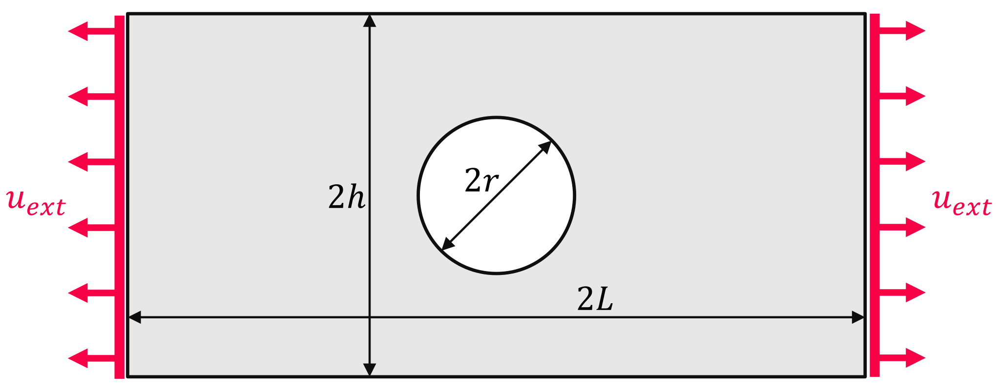
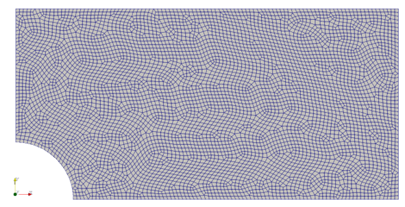
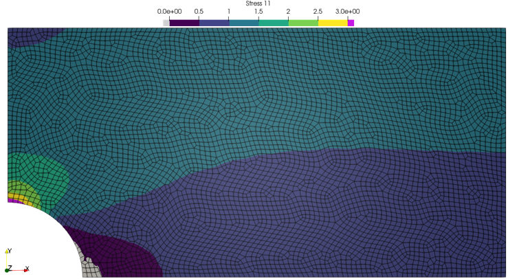
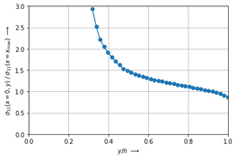

Plate with a Hole
-----------------

.. admonition:: Plane stress structural linear analysis.
   :class: note

   * create and mesh a plate with a hole
   
   * load a linear-elastic plane stress material
   
   * export and plot stress results

A plate with length :math:`2L`, height :math:`2h` and a hole with radius :math:`r` is subjected to a displacement controlled uniaxial tension :math:`u_{ext}`. What is being looked for is the concentration of normal stress :math:`\sigma_{11}` over the hole.

Let's create a meshed plate with a hole out of quad cells with the help of ``pygmsh`` (install with ``pip install pygmsh``). Only a quarter model of the plate is considered. A boolean difference between a rectangle and a disk results in a plate with a hole. This plate is meshed with triangles. A so-called *re-combination* of the surface mesh gives a mesh with quad cells.

..  code-block:: python

    import felupe as fe
    import pygmsh

    h = 1.0
    L = 2.0
    r = 0.3

    with pygmsh.occ.Geometry() as geom:
        
        geom.characteristic_length_min = 0.02
        geom.characteristic_length_max = 0.02

        rectangle = geom.add_rectangle([0, 0, 0], L, h)
        disk = geom.add_disk([0, 0, 0], r)
        
        plate = geom.boolean_difference(rectangle, disk)
        
        geom.set_recombined_surfaces(plate)
        mesh = geom.generate_mesh()

The points and cells of the above mesh are used to initiate a FElupe mesh.

..  code-block:: python

    mesh = fe.Mesh(
        points=mesh.points[:, :2], 
        cells=mesh.cells[1][1], 
        cell_type=mesh.cells[1][0]
    )

A numeric quad-region created on the mesh in combination with a vector-valued displacement field represents the plate. A uniaxial loadcase is applied on the displacement field. This involves setting up symmetry planes as well as the absolute value of the prescribed displacement in direction :math:`x` at the mesh-points on the right-end face of the rectangle.

..  code-block:: python

    region = fe.RegionQuad(mesh)
    displacement = fe.Field(region, dim=2)

    boundaries, dof0, dof1, ext0 = fe.dof.uniaxial(
        displacement, move=0.001, right=L, clamped=False
    )

The material behavior is defined through a built-in isotropic linear-elastic material formulation for plane stress problems.

..  code-block:: python

    umat = fe.LinearElasticPlaneStress(E=210000, nu=0.3)
    

The weak form of linear elasticity is assembled into the stiffness matrix, where the constitutive elasticity matrix is generated with :func:`umat.hessian` (or the alias :func:`umat.elasticity`).

.. math::

   \delta W_{int} = - \int_v \delta \boldsymbol{\varepsilon} : \mathbb{C} : \boldsymbol{\varepsilon} \ dv

..  code-block:: python

    K = fe.IntegralForm(
        fun=umat.elasticity(), 
        v=displacement, 
        dV=region.dV, 
        u=displacement, 
        grad_v=True,
        grad_u=True,
    ).assemble()

The linear equation system may now be solved. First, a partition into active and inactive degrees of freedom is performed. This partitioned system is then passed to the solver. The resulting displacements are directly added to the displacement field.

..  code-block:: python

    system = fe.solve.partition(displacement, K, dof1, dof0)
    displacement += fe.solve.solve(*system, ext0)

Let's evaluate the deformation gradient from the displacement field and calculate the stress tensor. This process is also called *stress recovery*.

..  code-block:: python

    F = displacement.extract()
    stress = umat.gradient(F)

However, the stress results are still located at the numeric integration points. Let's project them to mesh points. Beside the stress tensor we are also interested in the equivalent stress von Mises. For the two-dimensional case it is calculated as:

.. math::

   \sigma_{vM} = \sqrt{\sigma_{11}^2 + \sigma_{22}^2 + 3 \ \sigma_{12}^2 + \sigma_{11} \ \sigma_{22}}

..  code-block:: python

    import numpy as np
    
    vonmises = np.sqrt(
        stress[0, 0] ** 2 + stress[1, 1] ** 2 + 3 * stress[0, 1] ** 2 +
        stress[0, 0] * stress[1, 1]
    )
    
    stress_projected = fe.project(stress, region)
    vonmises_projected = fe.project(vonmises, region)

Results are saved as VTK-files, where additional point-data is passed within the ``point_data`` argument. Stresses are normalized by the mean value of the stress at the right end-face in order to visualize a normalized stress distribution over the plate.
    
..  code-block:: python

    right = mesh.points[:, 0] == L

    fe.save(
        region, 
        displacement, 
        filename="plate_with_hole.vtk",
        point_data={
            "Stress": (stress_projected / 
                stress_projected[right].mean(axis=0)
            ),
            "Stress-von-Mises": (vonmises_projected / 
                vonmises_projected[right].mean(axis=0)
            ),
        },
    )

The normal stress distribution over the hole at :math:`x=0` is plotted with matplotlib.

..  code-block:: python

    import matplotlib.pyplot as plt
	
    left = mesh.points[:, 0] == 0

    plt.plot(
        mesh.points[:, 1][left] / h, 
        (stress_projected / 
            stress_projected[right].mean(axis=0)
        )[:, 0][left],
        "o-"
    )
    
    plt.xlim(0, 1)
    plt.ylim(0, 3)
    
    plt.grid()
    
    plt.xlabel(r"$y/h\ \longrightarrow$")
    plt.ylabel(r"$\sigma_{11}(x=0, y)\ /\ \sigma_{11}(x=x_{max})$ $\longrightarrow$")

