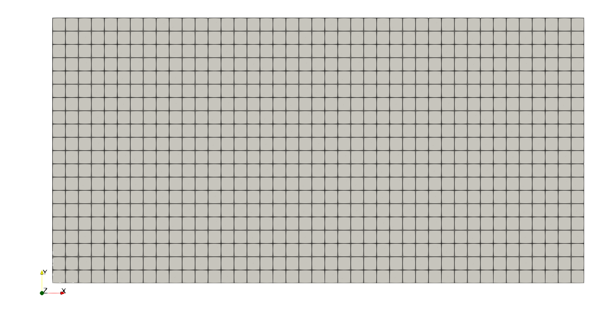
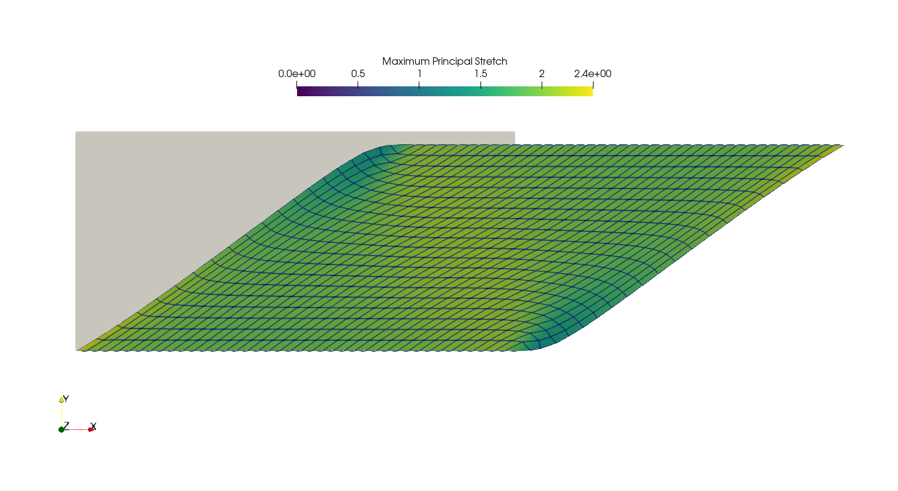
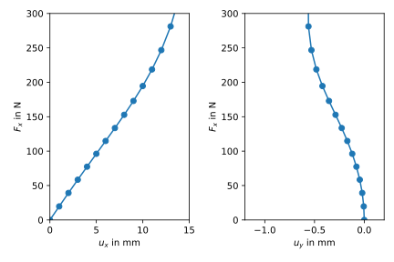

Non-homogenous shear loadcase
-----------------------------

.. admonition:: Plane strain hyperelastic non-homogenous shear loadcase
   :class: note

   * define a non-homogenous shear loadcase
   
   * use a mixed hyperelastic formulation in plane strain
   
   * assign a micro-sphere material formulation
   
   * export and visualize principal stretches
   
   * plot force - displacement curves

Two rubber blocks of height :math:`H` and length :math:`L`, both glued to a 
rigid plate on their top and bottom faces, are subjected to a displacement 
controlled non-homogenous shear deformation by :math:`u_{ext}` in combination 
with a compressive normal force :math:`F`. What is being looked for is the 
shear stress as a function of ?

.. image:: images/shear.svg
   :width: 400px

Let's create the mesh. An additional center-point is created for a multi-point
constraint (MPC). By default, FElupe stores points not connected to any cells in
:attr:`Mesh.points_without_cells` and adds them to the list of inactive
degrees of freedom. Hence, we have to drop our MPC-centerpoint from that list.

..  code-block:: python

    import numpy as np
    import felupe as fe

    H = 10
    L = 20
    T = 10
    
    n = 21
    a = min(L / n, H / n)
    
    mesh = fe.Rectangle((0, 0), (L, H), n=(round(L / a), round(H / a)))
    mesh.points = np.vstack((mesh.points, [0, 2 * H]))
    mesh.update(mesh.cells)
    mesh.points_without_cells = np.array([], dtype=bool)

A numeric quad-region created on the mesh in combination with a vector-valued 
displacement field as well as scalar-valued fields for the hydrostatic pressure
and the volume ratio represents the rubber numerically. A shear loadcase is 
applied on the displacement field. This involves setting up a y-symmetry plane 
as well as the absolute value of the prescribed shear movement in direction 
:math:`x` at the MPC-centerpoint.

..  code-block:: python

    region  = fe.RegionQuad(mesh)
    region0 = fe.RegionConstantQuad(mesh)
    
    displacement = fe.Field(region, dim=2)
    pressure     = fe.Field(region)
    volumeratio  = fe.Field(region, values=1)
    fields       = fe.FieldMixed((displacement, pressure, volumeratio))
    
    f0 = lambda y: np.isclose(y, 0)
    f2 = lambda y: np.isclose(y, 2* H)
    
    boundaries = {
        "fixed": fe.Boundary(displacement, fy=f0),
        "control": fe.Boundary(displacement, fy=f2, skip=(0, 1)),
    }
    
    dof0, dof1 = fe.dof.partition(fields, boundaries)
    ext0 = fe.dof.apply(displacement, boundaries, dof0)

The micro-sphere material formulation is used for the rubber. It is defined
as a hyperelastic material for plane strain in matADi (be sure to
install matADi with ``pip install matadi`` first).

..  code-block:: python

    import matadi as mat

    umat = fe.MatadiMaterial(
        mat.MaterialHyperelasticPlaneStrain(
            mat.models.miehe_goektepe_lulei, 
            mu=0.1475, 
            N=3.273, 
            p=9.31, 
            U=9.94, 
            q=0.567, 
            bulk=5000.0,
        )
    )

At the centerpoint of a multi-point constraint (MPC) the external shear
movement is prescribed. It also ensures a force-free top plate in direction 
:math:`y`.

..  code-block:: python

    MPC = fe.MultiPointConstraint(
        mesh=mesh,
        points=np.arange(mesh.npoints)[mesh.points[:, 1] == H],
        centerpoint=mesh.npoints - 1,
    )
    
    K_MPC = MPC.stiffness()

The shear movement is applied in increments, which are each solved with an
iterative newton-rhapson procedure. Inside an iteration, the force residual
vector and the tangent stiffness matrix are assembled. The fields are updated
with the solution of unknowns. The equilibrium is checked as ratio between the 
norm of residual forces of the active vs. the norm of the residual forces of 
the inactive degrees of freedom. If convergence is obtained, the iteration loop
ends. Both :math:`y`-displacement and the reaction force in direction :math:`x`
of the top plate are saved.

..  code-block:: python

    UX = np.linspace(0, 15, 16)
    UY = [0]
    FX = [0]
    
    for move in UX[1:]:
        
        boundaries["control"].value = move
        ext0 = fe.dof.apply(displacement, boundaries, dof0)
    
        for iteration in range(8):
        
            r_int = fe.IntegralFormMixed(
                fun=umat.gradient(*fields.extract()),
                v=fields,
                dV=region.dV,
            ).assemble(parallel=True).toarray()
            
            r_MPC = MPC.residuals(fields[0])
            r_MPC.resize(r_int.shape)
            r_MPC = r_MPC.toarray()
        
            r = r_int + r_MPC
            
            K = fe.IntegralFormMixed(
                fun=umat.hessian(*fields.extract()),
                v=fields,
                dV=region.dV,
                u=fields,
            ).assemble(parallel=True)
            
            K_MPC.resize(K.shape)
            K += K_MPC
        
            system = fe.solve.partition(fields, K, dof1, dof0, r)
            fields += np.split(fe.solve.solve(*system, ext0), fields.offsets)
            
            if iteration > 0:
                
                ref = np.linalg.norm(r[dof0]) if np.linalg.norm(r[dof0]) != 0 else 1
                norm = np.linalg.norm(r[dof1]) / ref
                print(iteration, norm)
            
                if norm <= 1e-9:
                    break
                
        UY.append(displacement.values[MPC.centerpoint, 1])
        FX.append(r[2 * MPC.centerpoint] * T)
        print("\nReaction Force FX(UX) =", move, FX[-1])

For the maximum deformed model a VTK-file containing principal stretches
projected to mesh points is exported.

..  code-block:: python

    from felupe.math import transpose, dot, eigh
    
    F = displacement.extract()
    C = dot(transpose(F), F)
    
    stretches = fe.project(np.sqrt(eigh(C)[0]), region)
    
    fe.save(region, displacement, point_data={
        "Maximum-principal-stretch": np.max(stretches, axis=1),
        "Minimum-principal-stretch": np.min(stretches, axis=1),
    })

The shear force :math:`F_x` vs. the displacements :math:`u_x` and
:math:`u_y`, all located at the top plate, are plotted.

..  code-block:: python

    import matplotlib.pyplot as plt
    
    fig, ax = plt.subplots(1, 2)
    
    ax[0].plot(UX, FX, 'o-')
    ax[0].set_xlim(0, 15)
    ax[0].set_ylim(0, 300)
    ax[0].set_xlabel(r"$u_x$ in mm")
    ax[0].set_ylabel(r"$F_x$ in N")
    
    ax[1].plot(UY, FX, 'o-')
    ax[1].set_xlim(-1.2, 0.2)
    ax[1].set_ylim(0, 300)
    ax[1].set_xlabel(r"$u_y$ in mm")
    ax[1].set_ylabel(r"$F_x$ in N")
    
    plt.tight_layout()
    
    plt.savefig("shear_plot.svg")

